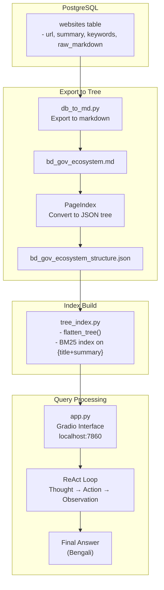

# Tree Index Agent

## Overview

The **Tree Index Agent** is a ReAct (Reason + Act) style AI agent that searches a hierarchical JSON tree of Bangladesh government websites using BM25 lexical search. It answers user queries in formal Bengali by navigating the government website structure.

---

## Files

| File | Purpose |
|------|---------|
| [`app.py`](app.py) | Gradio chat interface + ReAct agent loop |
| [`tree_index.py`](tree_index.py) | BM25 search on tree nodes |
| [`db_to_md.py`](db_to_md.py) | Export PostgreSQL data to markdown |
| [`db_query.py`](db_query.py) | Database query utility |
| [`utils.py`](utils.py) | Tree utilities (flatten, chunk) |
| [`config.py`](config.py) | System prompts + configuration |

---

## app.py

### Purpose

Gradio-based chat interface that runs the ReAct agent loop for querying the tree index.

### Server Configuration

```python
demo.launch(
    server_name="0.0.0.0",
    server_port=7860
)
```

**Access:** `http://localhost:7860`

### Key Function: `process_query(message, history)`

**Agent Loop Flow:**

```
1. Initialize messages with MASTER_SYSTEM_PROMPT
2. Add chat history (last 6 messages)
3. Add current user query
4. WHILE not resolved:
   a. Call LLM (Qwen35) with streaming
   b. Check for guardrail trigger
   c. Check for Final Answer marker
   d. Parse Action: tool_name("query")
   e. Execute tool (search_tree)
   f. Get observation back
   g. Feed observation to LLM
   h. Repeat until resolved or failsafe
```

### Agent Loop Safeguards

| Safeguard | Threshold |
|-----------|-----------|
| `safety_breaker` | 15 iterations max |
| `executed_actions` | Prevents repeated searches |
| Guardrail phrase | Immediate rejection |

### Guardrail Check

**Trigger Phrase:**
```
"দুঃখিত, সরকারি নীতিমালার আওতায়"
```

**Action:**
- Set `is_resolved = True`
- Return rejection message

### Final Answer Check

**Pattern:**
```python
r"(?i)\**Final Answer:\**|\**উত্তর:\**"
```

**Action:**
- Extract text after marker
- Set `is_resolved = True`

### Action Interceptor

**Pattern:**
```python
r"Action:\s*(\w+)\([\'\"]?(.*?)[\'\"]?\)"
```

**Supported Tools:**
- `search_tree(query)` - Search the tree index
- `search(query)` - Alias for search_tree
- `hybrid_search(query)` - Not implemented in tree version

**Execution:**
```python
if tool_name == "search_tree":
    obs_text = execute_tree_search(search_query)
```

### Gradio Interface

```python
demo = gr.ChatInterface(
    fn=process_query,
    title="🌳 BD Gov Discovery Engine (ReAct Agent)",
    description="Ask questions about Bangladesh Government services...",
    examples=[
        "খতিয়ান (ই-পর্চা) তোলার নিয়ম কি?",
        "প্রাথমিক শিক্ষা অধিদপ্তরের বদলি নীতিমালা কি?",
        "বাঘাইছড়ি উপজেলার পর্যটন কেন্দ্রগুলো কী কী?"
    ],
    fill_height=True
)
```

---

## tree_index.py

### Purpose

Implements BM25 search over a hierarchical JSON tree of government websites.

### Global State

```python
all_nodes = []    # Flattened list of all tree nodes
toc = []          # Table of contents with summaries
bm25 = None       # BM25 index object
```

### Initialization

**Load Tree:**
```python
with open(TREE_PATH, 'r', encoding='utf-8') as f:
    raw_data = json.load(f)
```

**Flatten Tree:**
```python
all_nodes = flatten_tree(root_nodes)
# Converts hierarchical tree to flat list
```

**Build Table of Contents:**
```python
for n in all_nodes:
    summary = extract from "**সারসংক্ষেপ**"
    toc.append({
        "node_id": n['node_id'],
        "title": n['title'],
        "summary": summary
    })
toc = [n for n in toc if n["summary"]]  # Filter empty
```

**Build BM25 Index:**
```python
corpus = [tokenize(n['title'] + " " + n['summary']) for n in toc]
bm25 = BM25Okapi(corpus)
```

### Key Function: `execute_tree_search(query)`

**Search Process:**

1. **Tokenize Query**
   ```python
   tokenized_query = tokenize(query)
   ```

2. **Retrieve Top-5 Nodes**
   ```python
   top_nodes = bm25.get_top_n(tokenized_query, toc, n=5)
   ```

3. **Extract Full Text**
   ```python
   selected_ids = [n['node_id'] for n in top_nodes]
   raw_full_texts = [node['text'] for node in all_nodes if node_id in selected_ids]
   combined_raw_text = "\n\n".join(raw_full_texts)
   ```

4. **Dynamic Chunking**
   ```python
   text_chunks = chunk_text(combined_raw_text, chunk_size=2000, overlap=300)
   ```

5. **Re-Rank if Too Many Chunks**
   ```python
   if len(text_chunks) > 3:
       chunk_bm25 = BM25Okapi([tokenize(c) for c in text_chunks])
       best_chunks = chunk_bm25.get_top_n(tokenized_query, text_chunks, n=3)
       final_context = "\n\n...[text omitted]...\n\n".join(best_chunks)
   else:
       final_context = combined_raw_text
   ```

6. **Return Context**
   ```python
   return final_context
   ```

---

## utils.py

### Purpose

Utility functions for tree manipulation and text processing.

### Functions

#### `flatten_tree(nodes_list)`

**Purpose:** Convert hierarchical tree to flat list.

**Logic:**
```python
def flatten_tree(nodes_list):
    flat_list = []
    for node in nodes_list:
        flat_list.append(node)
        if 'nodes' in node and isinstance(node['nodes'], list):
            flat_list.extend(flatten_tree(node['nodes']))
    return flat_list
```

#### `tokenize(text)`

**Purpose:** Simple word tokenization.

**Logic:**
```python
def tokenize(text):
    if not text: return []
    return re.findall(r'\w+', str(text).lower())
```

#### `chunk_text(text, chunk_size=2000, overlap=300)`

**Purpose:** Split text into overlapping chunks.

**Logic:**
```python
def chunk_text(text, chunk_size, overlap):
    chunks = []
    start = 0
    text_len = len(text)
    while start < text_len:
        end = start + chunk_size
        chunks.append(text[start:end])
        start += chunk_size - overlap  # Overlap for continuity
    return chunks
```

---

## db_to_md.py

### Purpose

Exports PostgreSQL data to markdown format for tree index building.

### Query

```sql
SELECT url, summary, keywords, raw_markdown
FROM websites
WHERE status = 'success' AND raw_markdown IS NOT NULL
```

### Output Format

```markdown
# Bangladesh Government Web Ecosystem

## https://example.gov.bd

**সারসংক্ষেপ (Summary):** ...

**কিওয়ার্ড (Keywords):** ...

**বিস্তারিত তথ্য (Detailed Content):**
...
---
```

### Key Logic

1. **Fetch records** from PostgreSQL
2. **Format headers** (push original markdown headers down 1 level)
3. **Inject AI summary** and keywords
4. **Write to file:** `../data/bd_gov_ecosystem.md`

### Usage

```bash
python db_to_md.py
```

**Output:** `bd_gov_ecosystem.md`

---

## db_query.py

### Purpose

Utility script to query and export database records.

### Usage

```bash
python db_query.py
```

**Output:** `output.txt` with all database records

---

## config.py

### Purpose

Configuration and system prompts for the agent.

### Configuration

```python
MODEL_NAME = "qwen35"
TREE_PATH = "../PageIndex/results/bd_gov_ecosystem_structure.json"
MAX_HOPS = 5
```

### Master System Prompt

The prompt defines:

1. **Guardrails:**
   - Reject self-harm, violence, terrorism, hacking queries
   - Guardrail phrase in Bengali

2. **Linguistic Rules:**
   - Output exclusively in formal Bengali
   - No colloquialisms
   - Respectful, bureaucratic tone

3. **Tool Repository:**
   - `search_tree(query)` - Only available tool

4. **ReAct Framework:**
   ```
   Thought → Action → Observation → (repeat) → Final Answer
   ```

5. **Escape Hatch:**
   - After 2-3 failed searches, inform user data unavailable

6. **Examples:**
   - Multi-hop retrieval example
   - Missing data example

---

## Data Flow




---

## Usage

### Start Agent

```bash
cd agent
python app.py
```

**Access:** `http://localhost:7860`

### Example Queries

```
খতিয়ান (ই-পর্চা) তোলার নিয়ম কি?
প্রাথমিক শিক্ষা অধিদপ্তরের বদলি নীতিমালা কি?
বাঘাইছড়ি উপজেলার পর্যটন কেন্দ্রগুলো কী কী?
```

### Check Agent Output

```bash
tail -f agent/output.txt
```

---

## Troubleshooting

### "Database not loaded properly"

- Tree file not found at `TREE_PATH`
- Run `db_to_md.py` first
- Ensure PageIndex JSON is generated

### "No relevant documents found"

- Query not in tree index
- Try broader Bengali keywords
- Check if data was indexed correctly

### "Agent Loop Error"

- vLLM not responding at `http://localhost:5000/v1`
- Check model name in `config.py`
- Review logs for LLM errors

### Guardrail Triggered

- Query may violate safety protocols
- Rephrase without sensitive content

---

*Last Updated: April 2026*
