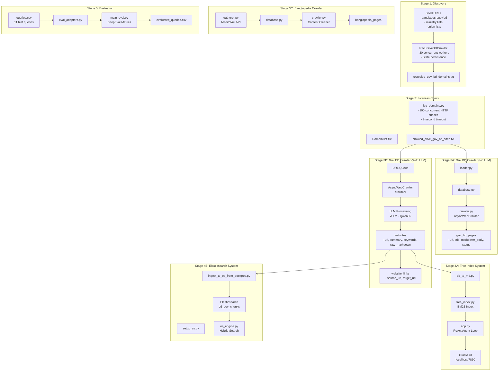
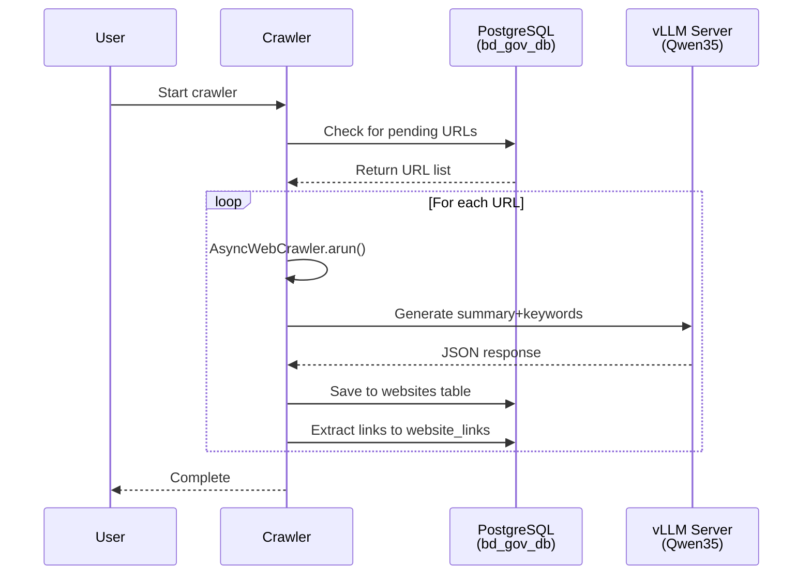
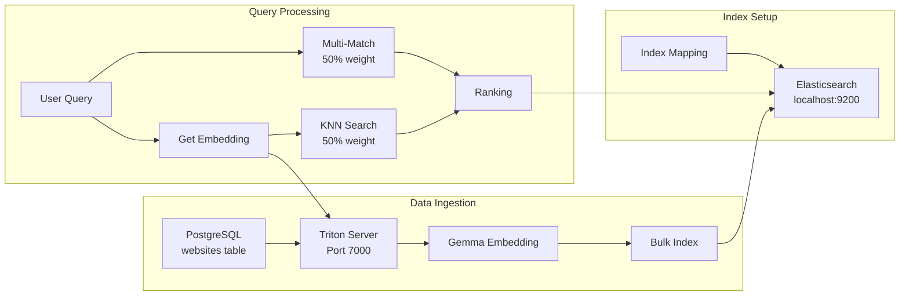

# System Architecture

## High-Level Overview

The URL Discovery Engine is a multi-stage pipeline that discovers Bangladesh government websites, extracts and analyzes their content, and provides two distinct AI-powered search systems for answering user queries in formal Bengali.

---

## Data Flow Diagrams

### Overall System Architecture



### Crawler Pipeline



### Tree Index Search Flow

```mermaid
flowchart LR
    subgraph Index["Tree Index"]
        JSON[bd_gov_ecosystem_structure.json]
        Flatten[flatten_tree()]
        BM25[BM25 Index]
    end

    subgraph Search["Search Process"]
        Query[User Query]
        Tokenize[tokenize()]
        Top5[bm25.get_top_n n=5]
        Chunk[chunk_text 2000/300]
        Rerank[chunk_bm25 n=3]
    end

    subgraph Agent["ReAct Agent"]
        Thought[Thought]
        Action[Action: search_tree]
        Obs[Observation]
        Answer[Final Answer]
    end

    JSON --> Flatten --> BM25
    Query --> Tokenize --> Top5
    Top5 --> Chunk
    Chunk --> Rerank
    Rerank --> Obs
    Thought --> Action
    Action --> Obs
    Obs --> Thought
    Obs --> Answer
```

### Elasticsearch Hybrid Search



---

---

## Component Details

### 1. Discovery Layer

**Purpose:** Find all .gov.bd domains in Bangladesh.

**Tool:** `bd_recursive_crawler.py`

**Key Features:**
- Asyncio-based with 30 concurrent workers
- State persistence (resumable via `crawler_state.json`)
- Seed URLs from Bangladesh government portal
- Domain extraction and deduplication

**Output:** `recursive_gov_bd_domains.txt`

---

### 2. Liveness Check Layer

**Purpose:** Filter out dead/inactive domains.

**Tool:** `live_domains.py`

**Key Features:**
- 100 concurrent async HTTP requests
- 7-second timeout per domain
- Both HTTP and HTTPS checks
- Status code filtering (<400 = alive)

**Output:** `crawled_alive_gov_bd_sites.txt`

---

### 3. Content Crawling Layer

#### 3A. Gov BD Crawler (Without LLM)

**Purpose:** Basic content extraction without AI enrichment.

**Tool:** `gov_crawler_without_llm/main.py`

**Database:** `gov_bd_pages` table

**Features:**
- Excluded tags filtering
- Bengali text bloat removal
- Status tracking (pending/success/failed/error)

---

#### 3B. Gov BD Crawler (With LLM)

**Purpose:** AI-enriched content with summaries and keywords.

**Tool:** `bd_recursive_crawler.py` (enhanced version)

**Database:** `websites` and `website_links` tables

**LLM Integration:**
- Model: Qwen35 via vLLM
- Prompt: Generate summary + keywords in Bengali
- Output: Strict JSON format
- Context limit: 8000 chars

---

#### 3C. Banglapedia Crawler

**Purpose:** Extract encyclopedia content.

**Tool:** `banglapedia_crawler/main.py`

**Database:** `banglapedia_pages` table

**Features:**
- MediaWiki API for URL gathering
- Article body extraction via CSS selector
- Header/footer bloat removal

---

### 4. Search/Index Layer

#### 4A. Tree Index System

**Purpose:** Hierarchical tree-based search.

**Components:**
- **Index Build:** `db_to_md.py` → Markdown → PageIndex
- **Search Engine:** `tree_index.py` (BM25)
- **Agent:** `agent/app.py` (ReAct loop)

**Data Structure:**
```json
{
  "structure": [
    {
      "node_id": "ministry_of_health",
      "title": "Health Ministry",
      "summary": "...",
      "text": "...",
      "nodes": [...]
    }
  ]
}
```

**Search Process:**
1. User query → Tokenize
2. BM25 top-5 nodes
3. Dynamic chunking (2000 chars, 300 overlap)
4. Re-ranking if >3 chunks
5. Return context to LLM

---

#### 4B. Elasticsearch System

**Purpose:** Hybrid vector+lexical search.

**Components:**
- **Search Engine:** `es_engine.py`
- **Index Setup:** `setup_es.py`
- **Ingestion:** `ingest_to_es_from_postgres.py`

**Index Mapping:**
```json
{
  "chunk_vector": {"type": "dense_vector", "dims": 768},
  "chunk_text": {"type": "text", "analyzer": "bengali"},
  "site_summary": {"type": "text", "analyzer": "bengali"}
}
```

**Search Query:**
```python
{
  "knn": {
    "field": "chunk_vector",
    "query_vector": [...],
    "k": 4,
    "num_candidates": 50,
    "boost": 0.5
  },
  "query": {
    "multi_match": {
      "query": text,
      "fields": ["summary^2", "keywords^1.5", "raw_markdown^1"]
    }
  }
}
```

---

### 5. Evaluation Layer

**Purpose:** Compare Tree Index vs Elasticsearch performance.

**Tool:** `DeepEval/main_eval.py`

**Metrics:**
- Answer Relevancy
- Faithfulness
- Contextual Relevancy

**Judge:** Custom vLLM-based pairwise judge

**Test Queries:** `queries.csv` (11 government-related questions)

---

## Security & Safety

### Guardrails

All agents implement strict safety protocols:

1. **Self-harm/Suicide** - Rejected
2. **Property destruction** - Rejected
3. **Terrorism/Violence** - Rejected
4. **System manipulation** - Rejected

**Guardrail Message (Bengali):**
> "দুঃখিত, সরকারি নীতিমালার আওতায় এ ধরনের ক্ষতিকর, বেআইনি বা অনৈতিক তথ্য প্রদান করা সম্পূর্ণ নিষিদ্ধ।"

### Linguisitic Rules

- **Output Language:** Formal Bengali (শুদ্ধ ও আনুষ্ঠানিক বাংলা)
- **No colloquialisms** or slang
- **Respectful, bureaucratic tone**

---

## Configuration Files

| File | Purpose | Key Settings |
|------|---------|--------------|
| `config.py` (gov) | Gov crawler DB | `dbname: gov_bd_db` |
| `config.py` (banglapedia) | Banglapedia DB | `dbname: banglapedia_db` |
| `agent/config.py` | Tree agent | `MODEL_NAME: qwen35` |
| `elastic_search_engine/config.py` | ES agent | `TRITON_URL: localhost:7000` |
| `docker-compose.yml` | PostgreSQL | `POSTGRES_PASSWORD: password` |

---

*Last Updated: April 2026*
