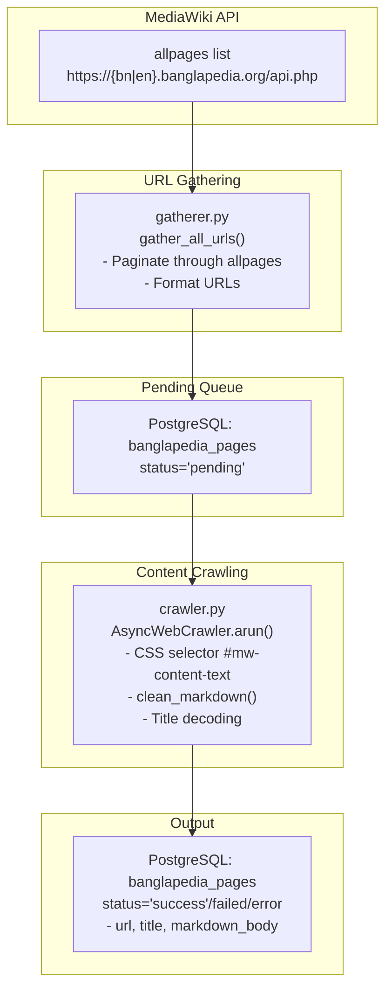

# Banglapedia Crawler

## Overview

This module crawls Banglapedia (বাংলাপিডিয়া), the Bengali encyclopedia, extracting article content and storing it in PostgreSQL. It supports both Bengali (bn) and English (en) versions.

---

## Files

| File | Purpose |
|------|---------|
| [`main.py`](main.py) | Pipeline orchestration |
| [`crawler.py`](crawler.py) | Async content extraction |
| [`gatherer.py`](gatherer.py) | MediaWiki API URL discovery |
| [`database.py`](database.py) | PostgreSQL operations |
| [`config.py`](config.py) | Configuration settings |

---

## main.py

### Purpose

Orchestrates the complete Banglapedia crawling pipeline.

### Execution Flow

```python
async def run_pipeline():
    1. setup_database()          # Ensure banglapedia_pages table exists
    2. await gather_all_urls()   # Fetch all article URLs from API (optional)
    3. await process_pending_urls()  # Crawl all pending URLs
```

### Usage

```bash
cd banglapedia_crawler
python main.py
```

---

## gatherer.py

### Purpose

Uses MediaWiki API to discover all page URLs on Banglapedia.

### Key Function: `gather_all_urls()`

**API Endpoint:**
```
https://{bn|en}.banglapedia.org/api.php
```

**Parameters:**
```python
{
    "action": "query",
    "list": "allpages",
    "aplimit": "500",
    "format": "json"
}
```

**Logic:**
```python
1. Request first 500 pages from API
2. For each page:
   - Get title
   - Replace spaces with underscores
   - Build full URL
   - Insert into database as 'pending'
3. If 'continue' in response, paginate
4. Repeat until all pages collected
```

### Usage

Uncomment line 18 in `main.py` to run:
```python
await gather_all_urls()
```

**Output:** URLs inserted into `banglapedia_pages` table

---

## database.py

### Purpose

Manages PostgreSQL database operations for the banglapedia_pages table.

### Database Schema

```sql
CREATE TABLE banglapedia_pages (
    url TEXT PRIMARY KEY,
    title TEXT,
    markdown_body TEXT,
    status VARCHAR(50) DEFAULT 'pending',
    crawled_at TIMESTAMP
);
```

### Functions

| Function | Purpose |
|----------|---------|
| `get_connection()` | Return fresh DB connection |
| `setup_database()` | Create/verify banglapedia_pages table |
| `insert_pending_url(url)` | Add URL to queue (ON CONFLICT DO NOTHING) |
| `update_url_status(url, title, markdown, status)` | Update crawled content |
| `get_pending_urls()` | Return list of 'pending' URLs |

### Connection Settings

```python
DB_CONFIG = {
    "dbname": "banglapedia_db",
    "user": "postgres",
    "password": "password",
    "host": "localhost",
    "port": "5432"
}
```

---

## crawler.py

### Purpose

Async crawler that fetches and processes Banglapedia article content.

### Key Features

- Uses `crawl4ai.AsyncWebCrawler`
- CSS selector: `#mw-content-text`
- Word count threshold: 15
- Cache bypass: enabled
- Politeness delay: 0.5 seconds

### Key Function: `clean_markdown(raw_md, title)`

**Purpose:** Extract pure article content by removing header/footer bloat.

**Cleaning Steps:**

1. **Header Removal:**
   ```python
   - Find start marker: f"#  {title}"
   - If found, slice from there
   - Fallback: Find first H1 tag
   ```

2. **Footer Removal:**
   ```python
   - Look for '[http' (source link)
   - Look for "লুকানো বিষয়শ্রেণী:" (hidden categories)
   - Slice off everything after first match
   ```

**Logic:**
```python
1. raw_md = input from crawler
2. Find article start (H1 with title)
3. Find article end (footer markers)
4. Return cleaned content
```

### Key Function: `process_pending_urls()`

**Flow:**
```python
1. Get all 'pending' URLs from database
2. For each URL:
   - AsyncWebCrawler.arun() with css_selector="#mw-content-text"
   - On success:
     - Decode title from URL
     - Clean markdown content
     - Update status to 'success'
   - On failure: update status to 'failed'/'error'
   - 0.5 second delay for politeness
```

---

## Configuration

### Database

| Setting | Value |
|---------|-------|
| Database | banglapedia_db |
| User | postgres |
| Password | password |
| Host | localhost |
| Port | 5432 |

### Language

```python
BANGLAPEDIA_LANG = "bn"  # or "en" for English
```

### Crawler Settings

| Setting | Value |
|---------|-------|
| CSS Selector | #mw-content-text |
| Word threshold | 15 |
| Cache | True (bypass_cache=True) |
| Politeness delay | 0.5s |

---

## Status Values

| Status | Meaning |
|--------|---------|
| `pending` | URL loaded, not yet crawled |
| `success` | Successfully crawled with content |
| `failed` | Crawler returned success=False |
| `error` | Exception during crawling |

---

## Data Flow




---

## Usage Examples

### Full Pipeline

```bash
python main.py
```

### Skip URL Gathering (if already collected)

Comment out line 18 in `main.py`:
```python
# await gather_all_urls()
```

### Change Language

Edit `config.py`:
```python
BANGLAPEDIA_LANG = "en"  # English instead of Bengali
```

### Manual URL Insertion

```python
from database import insert_pending_url
insert_pending_url("https://bn.banglapedia.org/index.php?title=Example")
```

### Check Pending URLs

```python
from database import get_pending_urls
pending = get_pending_urls()
print(f"{len(pending)} URLs to crawl")
```

---

## Troubleshooting

### "No pending URLs to crawl"

- Run `gather_all_urls()` first (uncomment in `main.py`)
- Check if URLs were inserted into database

### API Rate Limiting

- Banglapedia API may throttle requests
- Increase delay between API calls if needed

### Empty Content

- Some pages may have minimal content
- Word threshold filter may skip them

### Title Decoding Issues

- URL-encoded titles should decode correctly
- Check for special characters in titles

---

*Last Updated: April 2026*
