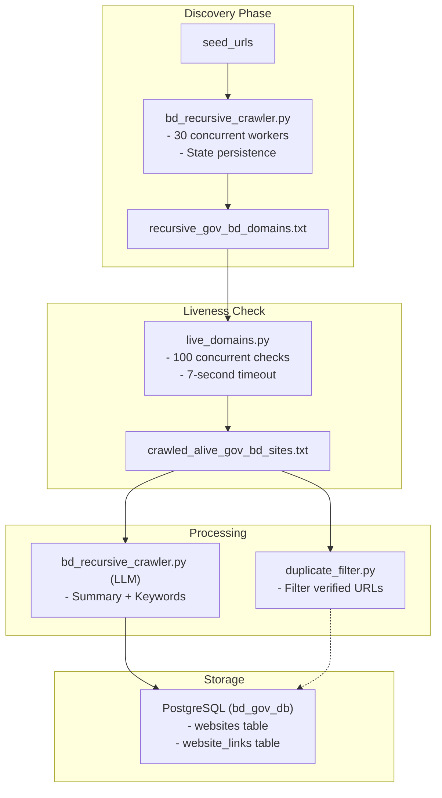

# Crawler Module

## Overview

The **crawler** module contains the core domain discovery and content processing components. It handles recursive discovery of .gov.bd domains, liveness checking, and AI-enriched content crawling with PostgreSQL storage.

---

## Files

| File | Purpose | Key Functions |
|------|---------|---------------|
| [`bd_recursive_crawler.py`](bd_recursive_crawler.py) | Main recursive domain discoverer | `RecursiveBDCrawler` |
| [`live_domains.py`](live_domains.py) | Domain liveness checker | `run_checker()` |
| [`link_extractor.py`](link_extractor.py) | Extract links from markdown | `extract_markdown_links()` |
| [`duplicate_filter.py`](duplicate_filter.py) | Filter verified URLs | `filter_verified_urls()` |
| [`main_crawler.py`](main_crawler.py) | Filter CSV URLs | `filter_verified_urls()` |

---

## bd_recursive_crawler.py

### Purpose

Discovers all .gov.bd domains recursively starting from seed URLs on `bangladesh.gov.bd`.

### Architecture

```python
class RecursiveBDCrawler:
    - seed_urls: List of starting points
    - found_domains: Set of discovered .gov.bd domains
    - visited_urls: Set of processed URLs
    - queue: asyncio.Queue for work distribution
    - semaphore: Asyncio semaphore (max 30 concurrent)
```

### Key Methods

#### `load_state()` / `save_state()`

**Purpose:** Enable resumable crawling.

**State File:** `crawler_state.json`

**Saved:**
- `visited_urls`: Set of processed URLs
- `queue`: Remaining URLs to process

#### `get_gov_bd_domain(url)`

**Purpose:** Extract .gov.bd domain from URL.

**Logic:**
```python
- Parse URL → netloc
- Remove 'www.' prefix
- Remove port numbers
- Return only if ends with '.gov.bd'
```

#### `worker(session, worker_id)`

**Purpose:** Async worker that processes URLs from queue.

**Flow:**
```
1. Get URL from queue
2. Check if already visited
3. Fetch & parse HTML
4. Extract all links
5. For each link:
   - Get domain (if .gov.bd)
   - Add to found_domains if new
   - Add to queue if not visited
```

#### `run()`

**Purpose:** Main entry point.

**Execution:**
```python
1. Load state (if exists) OR seed URLs
2. Create 30 worker tasks
3. await queue.join()
4. On Ctrl+C: save state and exit
```

### Usage

```bash
cd crawler
python bd_recursive_crawler.py
```

**Output:** `recursive_gov_bd_domains.txt`

**State:** `crawler_state.json`

---

## live_domains.py

### Purpose

Check which discovered domains are actually alive and accessible.

### Configuration

| Parameter | Default |
|-----------|---------|
| Input file | `recursive_gov_bd_domains.txt` |
| Output file | `crawled_alive_gov_bd_sites.txt` |
| Concurrency | 100 |
| Timeout | 7 seconds |

### Key Function: `check_domain(session, domain, semaphore)`

**Logic:**
```python
1. Try HTTPS first, then HTTP
2. 7-second timeout
3. Status < 400 = alive
4. Return first working URL
```

### Usage

```bash
python live_domains.py
```

**Output:** `crawled_alive_gov_bd_sites.txt`

```
https://example.gov.bd
http://example2.gov.bd
...
```

---

## link_extractor.py

### Purpose

Extract hyperlinks from markdown content and store relationships in PostgreSQL.

### Database Table

```sql
CREATE TABLE website_links (
    id SERIAL PRIMARY KEY,
    source_url TEXT REFERENCES websites(url) ON DELETE CASCADE,
    target_url TEXT,
    created_at TIMESTAMP DEFAULT CURRENT_TIMESTAMP,
    UNIQUE(source_url, target_url)
);
```

### Key Function: `extract_markdown_links(markdown_text, base_url)`

**Logic:**
```python
1. Regex: r'\[.*?\]\((https?://[^\s\)]+)\)'
2. Filter self-referencing links
3. Ignore URLs > 2000 chars (PostgreSQL B-Tree limit)
4. Return clean link list
```

### Usage

```bash
python link_extractor.py
```

**Process:**
1. Fetch all `websites` with `status='success'`
2. Extract links from `raw_markdown`
3. Insert into `website_links` table

---

## duplicate_filter.py

### Purpose

Filter a large URL list against verified URLs to find new candidates.

### Configuration

```python
URL_COLUMN_NAME = 'Link'
main_csv_path = 'crawled_alive_sites.csv'
verified_csv_pattern = 'govbddir/*.csv'
output_csv_path = 'filtered_urls.csv'
```

### Key Function: `filter_verified_urls()`

**Logic:**
```python
1. Load main CSV (39k URLs)
2. Load all verified CSVs from govbddir/
3. Build set of verified URLs
4. Filter out verified URLs from main list
5. Save remaining URLs
```

**Result:** New URLs not yet verified

---

## main_crawler.py

### Purpose

Same as `duplicate_filter.py` - filters main CSV against verified files.

### Usage

```bash
python main_crawler.py
```

**Output:** `filtered_urls.csv`

---

## Data Flow




---

## Configuration

### Environment

| Variable | Value |
|----------|-------|
| Max concurrent requests | 30 |
| Workers | 30 |
| Timeout | 15 seconds |
| Liveness timeout | 7 seconds |
| Liveness concurrency | 100 |

### User-Agent

```
BD-Gov-Ecosystem-Mapper/3.0 (Research)
```

---

## Error Handling

### Crawler

- `asyncio.CancelledError`: Graceful shutdown on Ctrl+C
- State saved before exit
- Retry on transient failures

### Liveness Check

- Timeout exceptions ignored
- Tries both HTTP and HTTPS
- Continues on failures

### Link Extraction

- URLs > 2000 chars skipped
- PostgreSQL constraint handles duplicates

---

*Last Updated: April 2026*
