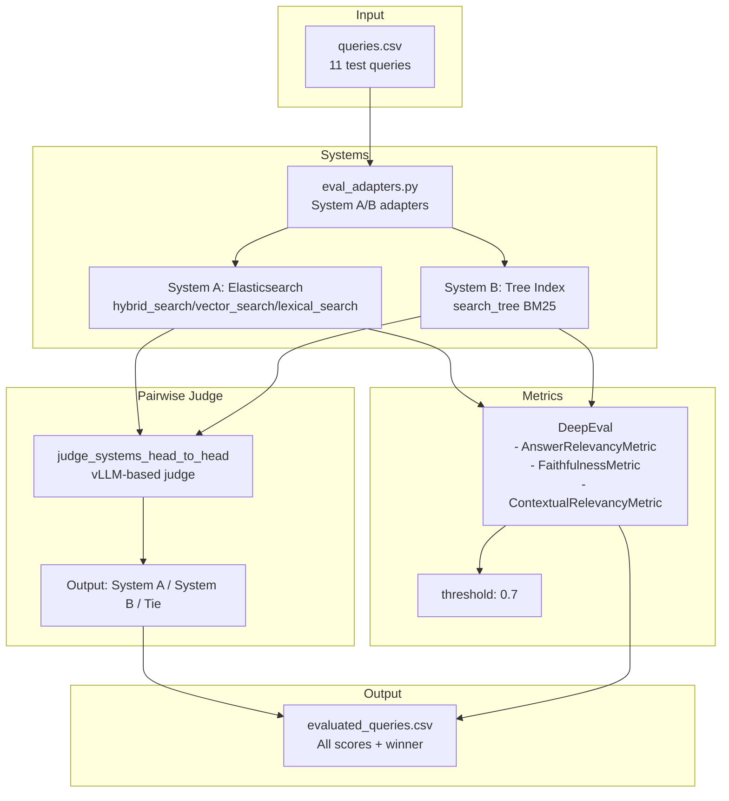

# DeepEval - System Evaluation Framework

## Overview

The **DeepEval** module provides a comprehensive evaluation framework for comparing the two search systems: **Tree Index Agent** vs **Elasticsearch Engine**. It uses the DeepEval library to compute automated metrics and a custom vLLM-based pairwise judge for head-to-head comparison.

---

## Files

| File | Purpose |
|------|---------|
| [`main_eval.py`](main_eval.py) | Evaluation pipeline orchestration |
| [`eval_adapters.py`](eval_adapters.py) | System A/B response adapters |
| [`eval_helpers.py`](eval_helpers.py) | Judge utilities and sanitization |
| [`eval_config.py`](eval_config.py) | System prompts and configuration |
| [`queries.csv`](queries.csv) | Test query dataset |

---

## main_eval.py

### Purpose

Orchestrates the complete evaluation pipeline, running both systems on test queries and computing metrics.

### Execution Flow

```python
async def run_evaluation():
    1. Load queries.csv (11 test queries)
    2. Initialize DeepEval metrics
    3. Run both systems on each query
    4. Compute automated metrics
    5. Run head-to-head pairwise judge
    6. Save results to evaluated_queries.csv
```

### Usage

```bash
cd DeepEval
python main_eval.py
```

**Output:** `evaluated_queries.csv`

---

## eval_adapters.py

### Purpose

Wraps the two search systems (Tree Index and Elasticsearch) for evaluation.

### System A: Elasticsearch Hybrid Agent

**Function:** `get_system_a_response(query: str)`

**Flow:**
```python
1. Initialize messages with MASTER_SYSTEM_PROMPT_ES
2. WHILE not resolved:
   a. Call vLLM (Qwen35)
   b. Check guardrails
   c. Check Final Answer marker
   d. Parse Action: tool_name("query")
   e. Execute hybrid_search/vector_search/lexical_search
   f. Get context from retrieve_context()
   g. Feed observation to LLM
   h. Repeat until resolved
3. Return (final_answer, all_retrieved_chunks)
```

**Tools:**
- `hybrid_search(query)` - Vector + Lexical
- `vector_search(query)` - Vector only
- `lexical_search(query)` - Lexical only

### System B: Tree Index Agent

**Function:** `get_system_b_response(query: str)`

**Flow:**
```python
1. Initialize messages with MASTER_SYSTEM_PROMPT_TREE
2. WHILE not resolved:
   a. Call vLLM (Qwen35)
   b. Check guardrails
   c. Check Final Answer marker
   d. Parse Action: search_tree("query")
   e. Execute BM25 search on tree
   f. Get observation back
   g. Feed observation to LLM
   h. Repeat until resolved
3. Return (final_answer, all_retrieved_chunks)
```

**Tool:**
- `search_tree(query)` - BM25 on tree index

---

## eval_helpers.py

### Purpose

Helper utilities for evaluation and pairwise judging.

### Functions

#### `sanitize_text_for_json(text)`

**Purpose:** Remove invalid control characters that cause JSONDecodeErrors.

**Logic:**
```python
- Regex: r'[\x00-\x08\x0b\x0c\x0e-\x1f\x7f-\x9f]'
- Removes control characters from text
- Handles list inputs recursively
```

#### `LocalVLLMJudge(DeepEvalBaseLLM)`

**Purpose:** Custom LLM wrapper for DeepEval metrics.

**Configuration:**
```python
class LocalVLLMJudge:
    model_name = "qwen35"
    base_url = "http://localhost:5000/v1"
```

**Methods:**
- `generate(prompt)` - Synchronous generation
- `a_generate(prompt)` - Async generation
- `get_model_name()` - Returns "Local-vLLM-qwen35"

#### `judge_systems_head_to_head(query, ans_a, ans_b)`

**Purpose:** Compare both answers using vLLM.

**Prompt:**
```
You are an impartial, expert AI judge evaluating two government assistant systems.

User Query: "{query}"
System A Answer: "{ans_a}"
System B Answer: "{ans_b}"

Evaluate which system provided a better, more accurate, and more formal Bengali response.
Penalize any response that contains system errors (like "Agent Loop Error") or hallucinations.

You must respond STRICTLY with exactly one of these three options:
System A
System B
Tie
```

**Output:**
- "System A"
- "System B"
- "Tie"
- "Tie (Both Failed)"

---

## eval_config.py

### Purpose

Configuration and system prompts for evaluation.

### Index Name

```python
INDEX_NAME = "bd_gov_chunks"
```

### MASTER_SYSTEM_PROMPT_ES (Elasticsearch System)

Defines agent behavior:

1. **Guardrails:**
   - Reject self-harm, violence, terrorism, hacking
   - Bengali rejection phrase

2. **Linguistic Rules:**
   - Formal Bengali only
   - No colloquialisms
   - Respectful, bureaucratic tone

3. **Tool Repository:**
   - `hybrid_search(query)` - Vector + Lexical (Best for general questions)
   - `vector_search(query)` - Semantic meaning
   - `lexical_search(query)` - Exact keyword matching

4. **ReAct Framework:**
   ```
   Thought → Action → Observation → (repeat) → Final Answer
   ```

5. **Escape Hatch:**
   - After 1-2 failed searches, inform user data unavailable

### MASTER_SYSTEM_PROMPT_TREE (Tree Index System)

Similar to ES prompt with differences:

1. **Tool Repository:**
   - `search_tree(query)` - Only available tool
   - Query expansion recommended on failures

2. **Escape Hatch:**
   - After 2-3 failed searches, inform user data unavailable

---

## queries.csv

### Purpose

Test dataset with 11 government-related questions in Bengali.

### Contents

```csv
queries
বয়স্ক ভাতা করার ক্ষেত্রে কি জন্ম নিবন্ধন আবশ্যক?
কর্মচারী কল্যাণ তহবিল থেকে অনুদান পেতে একজন চতুর্থ শ্রেণীর কর্মকর্তার কি করনীয়?
চাকরির জন্য নাগরিক সনদ নিতে কোথায় যেতে হবে?
আমার বাবা মুক্তিযোদ্ধা। মুক্তিযোদ্ধা সনদে তার নাম ভুল এসেছে। কীভাবে তার নাম সংশোধন করব?
মুক্তিযোদ্ধা গেজেটে নাম ভুল আসলে কীভাবে সংশোধন করতে হবে?
সন্তানের অভিভাবকত্ব গ্রহণ আর দত্তক নেওয়ার মধ্যে পার্থক্য কী?
চারিত্রিক সনদ নিতে কোথায় যোগাযোগ করতে হবে?
ঢাকায় ইন্টারমিডিয়েট পড়ুয়া নারি শিক্ষার্থীদের উপবৃত্তির ব্যবস্থা আছে কী?
প্রধানমন্ত্রীর শিক্ষা ট্রাস্ট কোন কোন ক্ষেত্রে শিক্ষার্থীদের বৃত্তি দিয়ে থাকে?
জেলা লেভেলে শিশুদের চিকিৎসায় এনআইসিইউ সুবিধা কোন কোন হাসপাতালে পাওয়া যাবে?
```

---

## Evaluation Metrics

DeepEval computes three key metrics for each system:

### 1. AnswerRelevancyMetric

**Purpose:** Measure how relevant the answer is to the query.

**Threshold:** 0.7

**Calculation:** LLM-based assessment of question-answer relevance

### 2. FaithfulnessMetric

**Purpose:** Measure how faithful the answer is to the retrieved context.

**Threshold:** 0.7

**Calculation:** Checks if claims are supported by retrieved context

### 3. ContextualRelevancyMetric

**Purpose:** Measure how relevant the retrieved context is to the query.

**Threshold:** 0.7

**Calculation:** LLM-based assessment of context relevance

---

## Output CSV

### Columns

| Column | Description |
|--------|-------------|
| `queries` | Original test query |
| `expected_answer` | Expected answer (if provided) |
| `sys_a_actual_answer` | Elasticsearch System answer |
| `sys_b_actual_answer` | Tree Index System answer |
| `sys_a_AnswerRelevancyMetric_score` | System A relevancy score |
| `sys_a_FaithfulnessMetric_score` | System A faithfulness score |
| `sys_a_ContextualRelevancyMetric_score` | System A context score |
| `sys_b_AnswerRelevancyMetric_score` | System B relevancy score |
| `sys_b_FaithfulnessMetric_score` | System B faithfulness score |
| `sys_b_ContextualRelevancyMetric_score` | System B context score |
| `vLLM_Winner` | Head-to-head winner |

---

## Data Flow



---

## Usage

### Run Full Evaluation

```bash
cd DeepEval
python main_eval.py
```

### Check Evaluation Results

```bash
cat evaluated_queries.csv
```

### View Results in Pandas

```python
import pandas as pd
df = pd.read_csv('evaluated_queries.csv')
print(df[['queries', 'vLLM_Winner']].to_string())
```

---

## Example Output

```
=== Row 1 ===
QUERIES: বয়স্ক ভাতা করার ক্ষেত্রে কি জন্ম নিবন্ধন আবশ্যক?
SYS_A_ACTUAL_ANSWER: হ্যাঁ, বয়স্ক ভাতার জন্য জন্ম নিবন্ধন আবশ্যক...
SYS_B_ACTUAL_ANSWER: হ্যাঁ, জন্ম নিবন্ধন একটি আবশ্যকীয় দলিল...
SYS_A_AnswerRelevancyMetric_score: 0.85
SYS_A_FaithfulnessMetric_score: 0.78
SYS_A_ContextualRelevancyMetric_score: 0.82
SYS_B_AnswerRelevancyMetric_score: 0.88
SYS_B_FaithfulnessMetric_score: 0.80
SYS_B_ContextualRelevancyMetric_score: 0.84
vLLM_Winner: System B
```

---

## Troubleshooting

### "vLLM not responding"

- Ensure vLLM is running on `http://localhost:5000/v1`
- Check model name in `eval_config.py`

### "Agent Loop Error"

- Agent exceeded safe computation limits (15 iterations)
- Check if query is answerable from available data

### JSON Decode Error

- Some answers may contain invalid control characters
- `sanitize_text_for_json()` should handle this

### Low Scores

- Retrieved context may be incomplete
- Try different search queries
- Check if data was indexed correctly

---

*Last Updated: April 2026*
