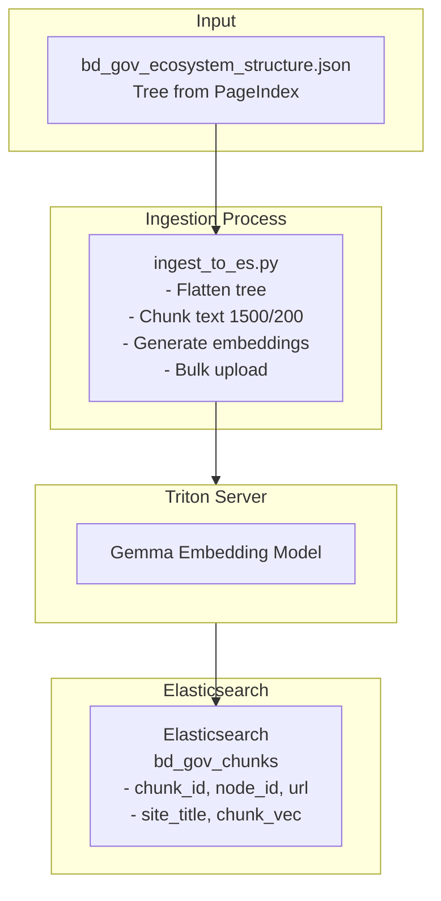
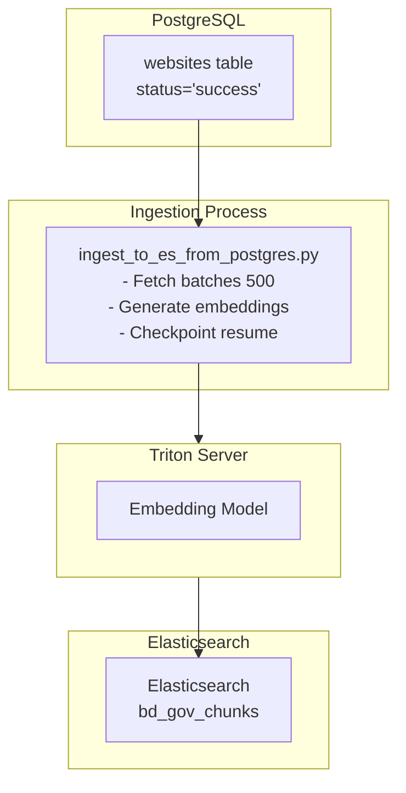
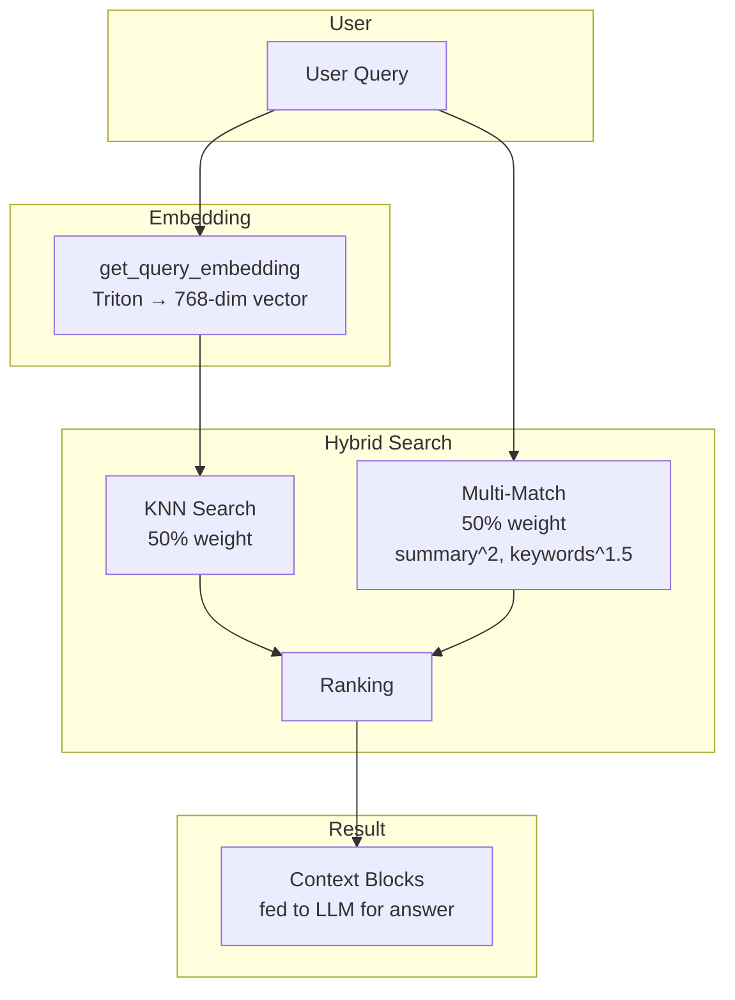

# Elasticsearch Search Engine

## Overview

The **Elasticsearch Engine** implements a hybrid search system combining vector similarity (from Triton Inference Server) with lexical search (BM25/multi-match). It indexes Bangladesh government website content for fast, accurate retrieval in Bengali.

---

## Files

| File | Purpose |
|------|---------|
| [`es_engine.py`](es_engine.py) | Search functions + embedding |
| [`setup_es.py`](setup_es.py) | Index creation |
| [`ingest_to_es.py`](ingest_to_es.py) | Tree-based ingestion |
| [`ingest_to_es_from_postgres.py`](ingest_to_es_from_postgres.py) | PostgreSQL-based ingestion |
| [`check_data.py`](check_data.py) | Test query utility |
| [`reset_es.py`](reset_es.py) | Index deletion |
| [`config.py`](config.py) | Configuration settings |

---

## es_engine.py

### Purpose

Core search engine implementing hybrid search and embedding generation.

### Dependencies

```python
import numpy as np
from elasticsearch import Elasticsearch
import tritonclient.http as httpclient
from transformers import AutoTokenizer
```

### Global State

```python
triton_client = InferenceServerClient(url=TRITON_URL)
tokenizer = AutoTokenizer.from_pretrained("google/embeddinggemma-300m")
es = Elasticsearch("http://localhost:9200")
```

### Key Function: `get_query_embedding(text)`

**Purpose:** Generate 768-dimensional vector for a query using Triton.

**Logic:**
```python
1. Format text: f"task: search result | query: {text}"
2. Tokenize with Gemma tokenizer
3. Prepare Triton inputs:
   - input_ids (INT64)
   - attention_mask (INT64)
4. Call Triton: gemma_embedding model
5. Return sentence_embedding as list
```

**Configuration:**
```python
TRITON_URL = "localhost:7000"
MODEL_NAME = "google/embeddinggemma-300m"
```

### Key Function: `retrieve_context(query_text, query_vector, top_k=4)`

**Purpose:** Hybrid search combining vector + lexical scoring.

**Search Query:**
```python
{
  "knn": {
    "field": "chunk_vector",
    "query_vector": query_vector,
    "k": top_k,
    "num_candidates": 50,
    "boost": 0.5  # 50% weight for vector
  },
  "query": {
    "multi_match": {
      "query": query_text,
      "fields": ["summary^2", "keywords^1.5", "raw_markdown^1"]
    }
  },
  "size": top_k
}
```

**Logic:**
1. **Vector Search (50%):** KNN on `chunk_vector`
2. **Lexical Search (50%):** Multi-match on text fields
3. **Field Boosting:**
   - `summary^2` - 2x weight
   - `keywords^1.5` - 1.5x weight
   - `raw_markdown^1` - 1x weight

**Output:**
```python
return context_string, source_urls_list
```

**Context Format:**
```
Source URL: https://example.gov.bd
Summary: ...
Content Details:
...
---
Source URL: https://example2.gov.bd
Summary: ...
...
```

---

## setup_es.py

### Purpose

Creates the Elasticsearch index with proper mappings.

### Index Configuration

```python
INDEX_NAME = "bd_gov_chunks"
ES_HOST = "http://localhost:9200"
```

### Index Mapping

```json
{
  "properties": {
    "chunk_id": {"type": "keyword"},
    "node_id": {"type": "keyword"},
    "url": {"type": "keyword"},
    "site_title": {"type": "text", "analyzer": "bengali"},
    "site_summary": {"type": "text", "analyzer": "bengali"},
    "chunk_text": {"type": "text", "analyzer": "bengali"},
    "chunk_vector": {
      "type": "dense_vector",
      "dims": 768,
      "index": true,
      "similarity": "cosine"
    }
  }
}
```

### Key Function: `create_index()`

**Logic:**
```python
1. Delete existing index (ignore if not exists)
2. Create new index with mappings
3. Return success message
```

**Safety:**
```python
if es.indices.exists(index=INDEX_NAME):
    doc_count = es.count(index=INDEX_NAME)['count']
    if doc_count > 0:
        confirm = input("Re-ingest all data? (y/N): ")
```

### Usage

```bash
python setup_es.py
```

---

## ingest_to_es.py

### Purpose

Ingests tree-based data into Elasticsearch with embeddings.

### Configuration

```python
ES_HOST = "http://localhost:9200"
INDEX_NAME = "bd_gov_chunks"
TREE_PATH = "../PageIndex/results/bd_gov_ecosystem_structure.json"
CHUNK_SIZE = 1500
CHUNK_OVERLAP = 200
BATCH_SIZE = 250
TRITON_URL = "localhost:7000"
```

### Key Function: `get_embeddings_from_triton(texts, batch_size=128)`

**Purpose:** Generate embeddings in batches.

**Logic:**
```python
1. Process texts in batches of 128
2. Tokenize with Gemma (max_length=512)
3. Prepare Triton inputs (input_ids, attention_mask)
4. Call Triton: gemma_embedding
5. Extend all_embeddings list
6. Return all vectors
```

**Batching Rationale:**
- Triton max_batch_size: 8
- Prevents OOM errors
- Respects model constraints

### Key Function: `chunk_text(text, chunk_size, overlap)`

**Purpose:** Split text into overlapping chunks.

**Logic:**
```python
1. Split text into words
2. Build chunks word by word
3. Stop at chunk_size
4. Keep overlap words for next chunk
5. Ignore tiny leftovers (<50 chars)
```

**Why Word-based:**
- Prevents cutting words in half
- Preserves semantic boundaries

### Key Function: `process_and_ingest()`

**Flow:**
```
1. Load tree JSON
2. Flatten tree to nodes
3. For each node:
   - Extract metadata (title, summary, url)
   - Chunk raw text
   - Create passage_text with prefix
4. Process in BATCH_SIZE batches:
   - Generate embeddings via Triton
   - Prepare ES bulk actions
   - helpers.bulk() to ES
   - Save checkpoint
5. Remove checkpoint when done
```

### Checkpoint System

```python
CHECKPOINT_FILE = "ingestion_progress.txt"

if os.path.exists(CHECKPOINT_FILE):
    with open(CHECKPOINT_FILE, "r") as f:
        start_index = int(f.read().strip())
        print(f"Resuming from Chunk #{start_index}...")
```

**Resume Logic:**
- Skips already processed chunks
- Saves next starting index after each batch
- Survives interruptions

### Usage

```bash
python ingest_to_es.py
```

**Output:** Documents indexed in Elasticsearch

---

## ingest_to_es_from_postgres.py

### Purpose

Ingests data directly from PostgreSQL (websites table) into Elasticsearch.

### Database Connection

```python
pg_conn = psycopg2.connect(
    dbname="bd_gov_db",
    user="postgres",
    password="password",
    host="localhost",
    port=5432
)
```

### Checkpoint by URL

**Resume Logic:**
```python
if last_url:
    query = """
        SELECT url, summary, keywords, raw_markdown
        FROM websites
        WHERE status = 'success' AND url > %s
        ORDER BY url ASC;
    """
    cursor.execute(query, (last_url,))
else:
    # Fresh start - create index
    query = """
        SELECT url, summary, keywords, raw_markdown
        FROM websites
        WHERE status = 'success'
        ORDER BY url ASC;
    """
```

### Key Function: `run_ingestion()`

**Flow:**
```
1. Get last checkpoint URL
2. Create index (if fresh)
3. Fetch records in batches of 500
4. For each batch:
   - Generate embedding via Triton
   - Prepare bulk actions
   - helpers.bulk() to ES
   - Save checkpoint URL
5. Remove checkpoint when done
```

### Embedding Generation

```python
text_to_embed = f"সারসংক্ষেপ: {summary}\n\nবিস্তারিত: {raw_markdown}"
vector = get_query_embedding(text_to_embed)
```

### Usage

```bash
python ingest_to_es_from_postgres.py
```

---

## check_data.py

### Purpose

Test queries against Elasticsearch for debugging.

### Example Query

```python
search_query = {
    "query": {
        "bool": {
            "must": [
                {"match": {"chunk_text": "মুক্তিযোদ্ধা"}}
            ],
            "should": [
                {"match": {"chunk_text": "সংশোধন"}},
                {"match": {"chunk_text": "নাম"}},
                {"match": {"chunk_text": "ভুল"}},
                {"match": {"chunk_text": "সনদ"}},
                {"match": {"chunk_text": "গেজেট"}},
                {"match": {"chunk_text": "আবেদন"}},
                {"match": {"chunk_text": "ফরম"}}
            ],
            "minimum_should_match": 3
        }
    },
    "size": 5,
    "_source": ["chunk_text", "url", "site_title"]
}
```

**Logic:**
- Must contain "মুক্তিযোদ্ধা"
- Should contain at least 3 of: সংশোধন, নাম, ভুল, সনদ, গেজেট, আবেদন, ফরম
- Returns top 5 matches

### Usage

```bash
python check_data.py
```

**Output:** Matching documents with scores

---

## reset_es.py

### Purpose

Safely delete the Elasticsearch index.

### Key Function: `delete_index()`

**Logic:**
```python
if es.indices.exists(index=INDEX_NAME):
    print("Deleting index...")
    es.indices.delete(index=INDEX_NAME)
    print("Index deleted!")
else:
    print("Index does not exist")
```

### Usage

```bash
python reset_es.py
```

**Confirmation:**
```
Are you sure you want to permanently delete 'bd_gov_chunks'? (y/n):
```

---

## config.py

### Purpose

Configuration settings for the Elasticsearch engine.

### Settings

```python
TRITON_URL = "localhost:7000"
INDEX_NAME = "bd_gov_chunks"
VLLM_URL = "http://localhost:5000/v1"
MODEL_NAME = "qwen35"
```

### Master System Prompt

Defines agent behavior:

1. **Guardrails:**
   - Reject self-harm, violence, terrorism, hacking
   - Bengali rejection phrase

2. **Linguistic Rules:**
   - Formal Bengali only
   - No colloquialisms
   - Respectful tone

3. **Tool Repository:**
   - `hybrid_search(query)` - Vector + Lexical
   - `vector_search(query)` - Vector only
   - `lexical_search(query)` - Lexical only

4. **ReAct Framework:**
   ```
   Thought → Action → Observation → (repeat) → Final Answer
   ```

5. **Escape Hatch:**
   - After 1-2 failed searches, inform user data unavailable

---

## Data Flow

### Tree-Based Ingestion



### PostgreSQL-Based Ingestion



### Query Flow




---

## Usage

### Setup Index

```bash
python setup_es.py
```

### Ingest Tree Data

```bash
python ingest_to_es.py
```

### Ingest from PostgreSQL

```bash
python ingest_to_es_from_postgres.py
```

### Test Query

```bash
python check_data.py
```

### Delete Index

```bash
python reset_es.py
```

---

## Troubleshooting

### "Connection refused to Triton"

- Triton not running on port 7000
- Start Triton server

### "Connection refused to Elasticsearch"

- ES not running on port 9200
- Start Elasticsearch

### "Index already exists with data"

- Run `reset_es.py` first
- Or skip re-ingestion

### Empty Search Results

- Check if data was ingested
- Try broader Bengali keywords
- Verify indexing completed

### Vector Dimension Mismatch

- Check Triton embedding model output
- Verify 768 dimensions expected

---

*Last Updated: April 2026*
