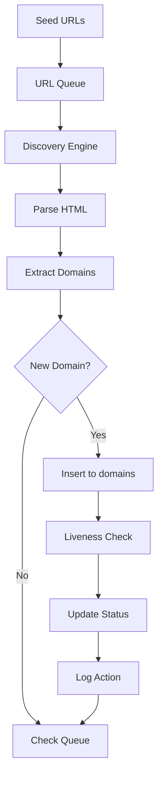

# Website Discovery Service

A persistent, 24x7 URL discovery service optimized for discovering Bangladeshi government (.gov.bd) domains.

## Overview

This service provides continuous domain discovery capabilities with:

- **Persistent State**: All data stored in PostgreSQL with ACID guarantees
- **Always-On Operation**: systemd-managed service with auto-restart
- **Seed URL Management**: Add seeds dynamically via .txt files
- **Domain-Only Discovery**: Focuses on domains, not webpage content
- **Liveness Tracking**: Real-time live/dead status with HTTP status codes
- **Retry Management**: Automatic retry for failed URLs with backoff
- **Audit Trail**: Complete discovery history in `discovery_log` table

## Quick Start

### Prerequisites

- **Python 3.10+**
- **PostgreSQL 15+**
- **systemd** (for production deployment)

### Installation

```bash
# Clone repository
git clone https://github.com/your-org/website-discovery /opt/url-discovery
cd /opt/url-discovery

# Create service user
sudo useradd -r -s /bin/false url-discovery

# Create virtual environment
python3 -m venv .venv
source .venv/bin/activate

# Install dependencies
pip install -e ".[dev]"

# Create logs directory
mkdir -p logs
sudo chown url-discovery:url-discovery logs

# Setup environment
cp .env.example .env
# Edit .env with your PostgreSQL credentials
```

### Database Setup

```bash
# Create database and user
sudo -u postgres psql << EOF
CREATE USER url_discovery WITH PASSWORD 'your_secure_password';
CREATE DATABASE url_discovery_db OWNER url_discovery;
GRANT ALL PRIVILEGES ON DATABASE url_discovery_db TO url_discovery;
EOF

# Run schema migration
.venv/bin/python -m src.database.schema
```

### Adding Seed URLs

```bash
# Create seed file (one URL per line)
echo -e "https://bangladesh.gov.bd\nhttps://ministry.gov.bd" > seeds/input/seeds.txt

# Ingest seeds
.venv/bin/python -m src.tools.ingest_seed_urls seeds/input/seeds.txt manual
```

### Running the Service

```bash
# Development mode
.venv/bin/python -m src.main

# Production mode (systemd)
sudo cp systemd/url-discovery.service /etc/systemd/system/
sudo systemctl daemon-reload
sudo systemctl enable url-discovery
sudo systemctl start url-discovery
```

### Verify Service Status

```bash
# Check service status
sudo systemctl status url-discovery

# View logs
sudo journalctl -u url-discovery -f

# Query discovered domains
psql -U url_discovery -d url_discovery_db -c "SELECT * FROM domains LIMIT 10;"
```

## Configuration

### Environment Variables (`.env`)

| Variable | Default | Description |
|----------|---------|-------------|
| `DB_HOST` | localhost | PostgreSQL host |
| `DB_PORT` | 5432 | PostgreSQL port |
| `DB_USER` | url_discovery | Database user |
| `DB_PASSWORD` | password | Database password |
| `DB_NAME` | url_discovery_db | Database name |
| `CRAWLER_SEED_FILE` | seeds/input.txt | Seed file path |
| `CRAWLER_MAX_CONCURRENT_REQUESTS` | 50 | Max concurrent HTTP requests |
| `CRAWLER_TIMEOUT` | 15 | Request timeout (seconds) |
| `LOG_LEVEL` | INFO | Log level (DEBUG/INFO/WARNING/ERROR) |

### Configuration File (`config.yaml`)

Most settings can also be configured via `config.yaml`. Values from environment variables take precedence.

```yaml
database:
  host: "${DB_HOST}"
  port: "${DB_PORT}"
  pool_size: 10

crawler:
  max_concurrent_requests: 50
  timeout: 15
  politeness_delay: 0.2

scheduler:
  check_interval: 300
  max_retries: 3
```

## Database Schema

### Tables

| Table | Description |
|-------|-------------|
| `domains` | Discovered domains with liveness status |
| `seed_urls` | Initial seed URLs |
| `url_queue` | Processing queue with priorities |
| `discovery_log` | Audit trail of all actions |

### Views

| View | Description |
|------|-------------|
| `v_live_domains` | Currently live domains |
| `v_dead_domains` | Dead domains needing recheck |
| `v_discovery_stats` | Aggregated statistics |
| `v_queue_summary` | Queue status summary |

See [docs/db_diagram.md](docs/db_diagram.md) for detailed schema documentation.

## CLI Tools

### Ingest Seed URLs

```bash
.venv/bin/python -m src.tools.ingest_seed_urls <file.txt> [source]

# Examples
.venv/bin/python -m src.tools.ingest_seed_urls seeds/input.txt manual
.venv/bin/python -m src.tools.ingest_seed_urls batch.csv batch
```

### Status Report

```bash
.venv/bin/python -m src.tools.status_report

# Output example:
# Total Domains: 1234
# Live: 1089 (88.2%)
# Dead: 145
# Queue Items: 23
```

## Architecture

See [docs/architecture.md](docs/architecture.md) for detailed architecture documentation.

### Service Flow



## Optimization

See [docs/optimization.md](docs/optimization.md) for performance optimization techniques including:

- Database indexing strategies
- Connection pooling configuration
- Queue priority management
- Memory management
- Caching strategies

## Monitoring

### Health Check (if enabled)

```bash
curl http://localhost:8080/health
```

### Log Monitoring

```bash
# Recent errors
sudo journalctl -u url-discovery | grep ERROR

# Queue processing
sudo journalctl -u url-discovery | grep "Queue processing"

# Discovery events
sudo journalctl -u url-discovery | grep "discovered"
```

### Database Queries

```sql
-- Recent discoveries
SELECT domain, discovered_at, is_live
FROM domains
WHERE discovered_at > NOW() - INTERVAL '24 hours'
ORDER BY discovered_at DESC;

-- Dead domains
SELECT domain, last_checked
FROM domains
WHERE is_live = FALSE
ORDER BY last_checked ASC
LIMIT 10;

-- Statistics
SELECT * FROM v_discovery_stats;
```

## Testing & Development

### Running Tests

```bash
# Run all tests (lint + test + typecheck)
nox

# Run tests only
nox -s test-3.12

# Run specific Python version
nox -s test-3.10
nox -s test-3.11
nox -s test-3.12

# Run tests with coverage
pytest tests/ -v --cov=src --cov-report=html

# Run specific test file
pytest tests/unit/test_config.py -v

# Run specific test class
pytest tests/unit/test_crawler.py::TestPriorityQueue -v

# Run specific test
pytest tests/unit/test_crawler.py::TestPriorityQueue::test_get_batch -v

# Run integration tests only
pytest tests/integration/ -v -m integration

# Run unit tests only
pytest tests/unit/ -v
```

### Running Linters

```bash
# Run all linters (ruff + mypy)
nox -s lint

# Run ruff (code style/linting)
python -m ruff check src/ tests/

# Auto-fix ruff issues
python -m ruff check src/ tests/ --fix

# Run mypy (type checking)
python -m mypy src/

# Run pre-commit hooks
pre-commit run --all-files
```

### Nox Sessions

| Session | Description |
|---------|-------------|
| `lint` | Run all linters (ruff, mypy) |
| `test-3.10` | Run tests with Python 3.10 |
| `test-3.11` | Run tests with Python 3.11 |
| `test-3.12` | Run tests with Python 3.12 |
| `format` | Format code with black and isort |
| `typecheck` | Run mypy type checking |

### Code Quality Checklist

Before committing code:

1. ✅ Run linting: `nox -s lint`
2. ✅ Run tests: `nox -s test-3.12`
3. ✅ Format code: `nox -s format -- --check`
4. ✅ Type check: `python -m mypy src/`

### Development Workflow

```bash
# 1. Create feature branch
git checkout -b feature/your-feature

# 2. Make changes
# ... edit files in src/ ...

# 3. Add tests for new features
pytest tests/ -v

# 4. Run linting
nox -s lint

# 5. Format code
nox -s format

# 6. Commit
git add .
git commit -m "feat: add your feature"

# 7. Push and create PR
git push origin feature/your-feature
```

### Continuous Integration

Tests and linting are run automatically on:
- Pull requests to main branch
- Daily scheduled runs
- Before any release

## Development

### Adding New Features

1. Create feature branch
2. Implement changes in `src/`
3. Add/update tests in `tests/`
4. Run linting: `nox -s lint`
5. Run tests: `nox -s test`
6. Format code: `nox -s format`

### Adding New Database Table

1. Update `migrations/001_initial_schema.sql`
2. Add model to `src/database/models.py`
3. Add connection methods to `src/database/connection.py`
4. Update schema initialization

## License

MIT License - See LICENSE file for details.

## Authors

URL Discovery Engine Team
