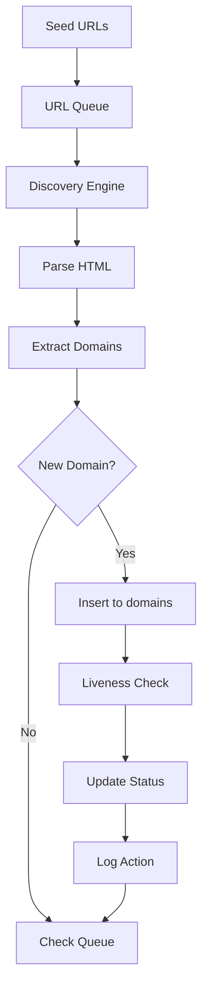

# Website Discovery Service

A persistent, 24x7 URL discovery service optimized for discovering Bangladeshi government (.gov.bd) domains.

## Overview

This service provides continuous domain discovery capabilities with:

- **Persistent State**: All data stored in PostgreSQL with ACID guarantees
- **Always-On Operation**: systemd-managed service with auto-restart
- **Seed URL Management**: Add seeds dynamically via .txt files
- **Domain-Only Discovery**: Focuses on domains, not webpage content
- **Liveness Tracking**: Real-time live/dead status with HTTP status codes
- **Retry Management**: Automatic retry for failed URLs with backoff
- **Audit Trail**: Complete discovery history in `discovery_log` table

## Prerequisites

- **Python 3.13** (managed via conda)
- **Conda** (Miniconda or Miniforge)
- **PostgreSQL 15+**
- **systemd** (for production deployment)

## Quick Start

### 1. Create the conda environment

```bash
conda create -n crawler python=3.13 -y
conda activate crawler
```

### 2. Install dependencies

```bash
# Install production dependencies
pip install -r requirements.txt

# Install the package in editable mode (for CLI entry points)
pip install -e .
```

### 3. Install dev dependencies

```bash
# Install development + testing tooling
pip install pytest pytest-asyncio pytest-cov nox mypy ruff black pre-commit
```

### 4. Setup the project

```bash

# Create logs directory
mkdir -p logs

# Setup environment
cp .env.example .env
# Edit .env with your PostgreSQL credentials
```

### 5. Database Setup

```bash
# Create database (run inside the PostgreSQL container)
docker exec -it $container_name psql -U $postgres 
CREATE DATABASE url_discovery_db;

# Run schema migration
python scripts/setup_database.py
```

### 6. Add Seed URLs

```bash
# Create seed file (one URL per line)
echo -e "https://bangladesh.gov.bd\nhttps://ministry.gov.bd" > seeds/input/seeds.txt

# Ingest seeds
python -m src.tools.ingest_seed_urls seeds/input/seeds.txt manual
```

### 7. Run the Service

```bash
# Development mode
python -m src.main

# Production mode (systemd)
# Update systemd unit with correct paths before installing
sed -i "s|User=vpa|User=<your-system-user>|g" systemd/url-discovery.service
sed -i "s|WorkingDirectory=.*|WorkingDirectory=<your-project-path>|g" systemd/url-discovery.service
sed -i "s|EnvironmentFile=.*|EnvironmentFile=<your-project-path>/.env|g" systemd/url-discovery.service
sed -i "s|Environment=\"PYTHONPATH=.*|Environment=\"PYTHONPATH=<your-project-path>|g" systemd/url-discovery.service
sed -i "s|ExecStart=.*|ExecStart=<path-to-conda-env>/bin/python -m src.main|g" systemd/url-discovery.service
sed -i "s|ReadWritePaths=.*|ReadWritePaths=<your-project-path>/logs|g" systemd/url-discovery.service

sudo cp systemd/url-discovery.service /etc/systemd/system/
sudo systemctl daemon-reload
sudo systemctl enable url-discovery
sudo systemctl start url-discovery
```

**Generic systemd unit template** — adjust these fields for your deployment:

| Field | What to change |
|-------|---------------|
| `User` / `Group` | System user that runs the service (e.g. `vpa`, `url-discovery`) |
| `WorkingDirectory` | Absolute path to the project root |
| `EnvironmentFile` | Absolute path to the `.env` file |
| `ExecStart` | Full path to the Python binary inside your conda venv |
| `ReadWritePaths` | Directories the service needs to write to (logs, data) |

Example:
```
User=vpa
WorkingDirectory=/home/vpa/Prod/url_discovery_engine/website_discovery
ExecStart=/home/vpa/miniconda3/envs/crawler/bin/python -m src.main
```

### 8. Verify Service Status

```bash
# Check service status
sudo systemctl status url-discovery

# View logs
sudo journalctl -u url-discovery -f

# Query discovered domains
psql -U url_discovery -d url_discovery_db -c "SELECT * FROM domains LIMIT 10;"
```

## Configuration

### Environment Variables (`.env`)

| Variable | Default | Description |
|----------|---------|-------------|
| `DB_HOST` | localhost | PostgreSQL host |
| `DB_PORT` | 5432 | PostgreSQL port |
| `DB_USER` | url_discovery | Database user |
| `DB_PASSWORD` | password | Database password |
| `DB_NAME` | url_discovery_db | Database name |
| `CRAWLER_SEED_FILE` | seeds/input.txt | Seed file path |
| `CRAWLER_MAX_CONCURRENT_REQUESTS` | 50 | Max concurrent HTTP requests |
| `CRAWLER_TIMEOUT` | 15 | Request timeout (seconds) |
| `LOG_LEVEL` | INFO | Log level (DEBUG/INFO/WARNING/ERROR) |

### Configuration File (`config.yaml`)

Most settings can also be configured via `config.yaml`. Values from environment variables take precedence.

```yaml
database:
  host: "${DB_HOST}"
  port: "${DB_PORT}"
  pool_size: 10

crawler:
  max_concurrent_requests: 50
  timeout: 15
  politeness_delay: 0.2

scheduler:
  check_interval: 300
  max_retries: 3
```

## Database Schema

### Tables

| Table | Description |
|-------|-------------|
| `domains` | Discovered domains with liveness status |
| `seed_urls` | Initial seed URLs |
| `url_queue` | Processing queue with priorities |
| `discovery_log` | Audit trail of all actions |

### Views

| View | Description |
|------|-------------|
| `v_live_domains` | Currently live domains |
| `v_dead_domains` | Dead domains needing recheck |
| `v_discovery_stats` | Aggregated statistics |
| `v_queue_summary` | Queue status summary |

See [docs/db_diagram.md](docs/db_diagram.md) for detailed schema documentation.

## CLI Tools

### Ingest Seed URLs

```bash
python -m src.tools.ingest_seed_urls <file.txt> [source]

# Examples
python -m src.tools.ingest_seed_urls seeds/input.txt manual
python -m src.tools.ingest_seed_urls batch.csv batch
```

### Status Report

```bash
python -m src.tools.status_report

# Output example:
# Total Domains: 1234
# Live: 1089 (88.2%)
# Dead: 145
# Queue Items: 23
```

### Database Setup Script

```bash
python scripts/setup_database.py

# Automatically:
#   1. Creates PostgreSQL user
#   2. Creates database (if not exists)
#   3. Grants permissions
#   4. Runs schema migration
#   5. Verifies tables, indexes, views, functions
```

### Database Verification Script

```bash
python scripts/verify_database.py
```

## Architecture

See [docs/architecture.md](docs/architecture.md) for detailed architecture documentation.

### Service Flow



## Optimization

See [docs/optimization.md](docs/optimization.md) for performance optimization techniques including:

- Database indexing strategies
- Connection pooling configuration
- Queue priority management
- Memory management
- Caching strategies

## Monitoring

### Health Check (if enabled)

```bash
curl http://localhost:8080/health
```

### Log Monitoring

```bash
# Recent errors
sudo journalctl -u url-discovery | grep ERROR

# Queue processing
sudo journalctl -u url-discovery | grep "Queue processing"

# Discovery events
sudo journalctl -u url-discovery | grep "discovered"
```

### Database Queries

```sql
-- Recent discoveries
SELECT domain, discovered_at, is_live
FROM domains
WHERE discovered_at > NOW() - INTERVAL '24 hours'
ORDER BY discovered_at DESC;

-- Dead domains
SELECT domain, last_checked
FROM domains
WHERE is_live = FALSE
ORDER BY last_checked ASC
LIMIT 10;

-- Statistics
SELECT * FROM v_discovery_stats;
```

## Testing

### Prerequisites

Ensure you have the dev dependencies installed:

```bash
conda activate crawler
pip install pytest pytest-asyncio pytest-cov
```

### Unit Tests

Tests for configuration, database models, crawler logic, and services:

```bash
# Run all unit tests
pytest tests/unit/ -v

# Run specific test file
pytest tests/unit/test_config.py -v
pytest tests/unit/test_crawler.py -v
pytest tests/unit/test_database_models.py -v
pytest tests/unit/test_services.py -v
```

### Integration Tests

End-to-end tests for the full discovery pipeline:

```bash
# Run all integration tests
pytest tests/integration/ -v

# Run integration tests only (marked with @pytest.mark.integration)
pytest tests/integration/ -v -m integration
```

### All Tests (Unit + Integration)

```bash
# Run all tests with verbose output
pytest tests/ -v

# Run all tests with coverage report
pytest tests/ -v --cov=src --cov-report=term-missing

# Run all tests with HTML coverage report
pytest tests/ -v --cov=src --cov-report=html

# Run tests and fail on the first error
pytest tests/ -v -x
```

### Specific Test Selection

```bash
# Run a specific test class
pytest tests/unit/test_crawler.py::TestPriorityQueue -v

# Run a specific test method
pytest tests/unit/test_crawler.py::TestPriorityQueue::test_get_batch -v

# Skip slow tests
pytest tests/ -v -m "not slow"
```

### Nox Sessions

Nox provides isolated virtual environments for testing:

```bash
# Run all default sessions (lint + test)
nox

# Run tests only
nox -s test

# Run linting only
nox -s lint

# Format code
nox -s format

# Check formatting without modifying files
nox -s format -- --check

# Run type checking with mypy
nox -s typecheck

# Run pre-commit hooks
nox -s pre_commit

# Clean generated files
nox -s clean
```

### Linters

```bash
# Run all linters (ruff + mypy)
nox -s lint

# Run ruff (code style/linting)
ruff check src/ tests/

# Auto-fix ruff issues
ruff check src/ tests/ --fix

# Run mypy (type checking)
mypy src/

# Run pre-commit hooks
pre-commit run --all-files
```

### Code Quality Checklist

Before committing code:

1. Run linting: `nox -s lint`
2. Run tests: `pytest tests/ -v --cov=src --cov-report=term-missing`
3. Format code: `nox -s format`
4. Type check: `mypy src/`

## Development Workflow

```bash
# 1. Activate the conda environment
conda activate crawler

# 2. Create feature branch
git checkout -b feature/your-feature

# 3. Make changes
# ... edit files in src/ ...

# 4. Add tests for new features
pytest tests/ -v

# 5. Run linting
nox -s lint

# 6. Format code
nox -s format

# 7. Commit
git add .
git commit -m "feat: add your feature"

# 8. Push and create PR
git push origin feature/your-feature
```

## Continuous Integration

Tests and linting are run automatically on:

- Pull requests to main branch
- Daily scheduled runs
- Before any release

## License

MIT License - See LICENSE file for details.

## Authors

URL Discovery Engine Team
