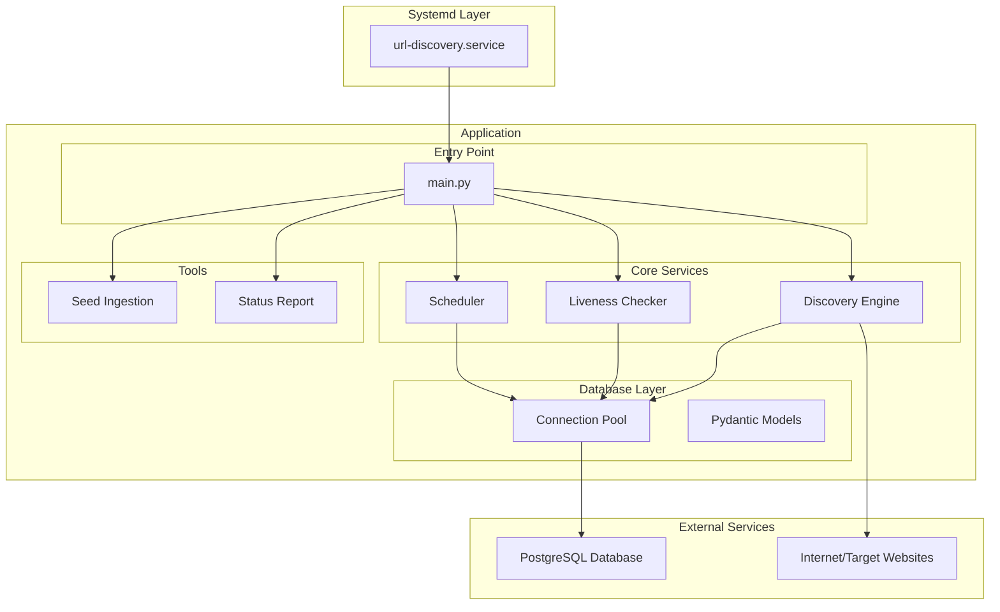
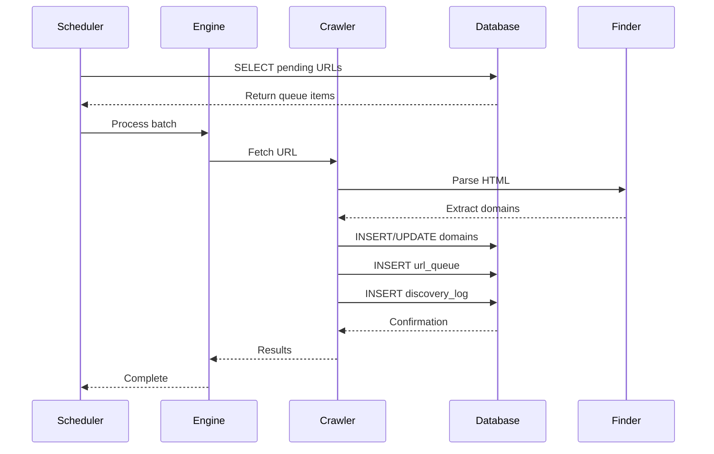
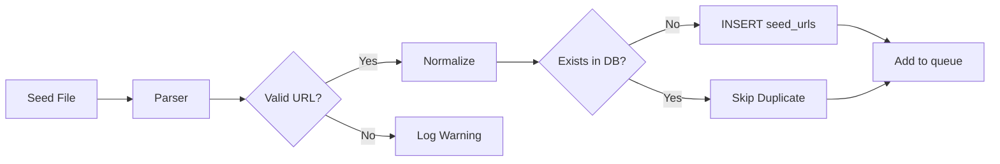
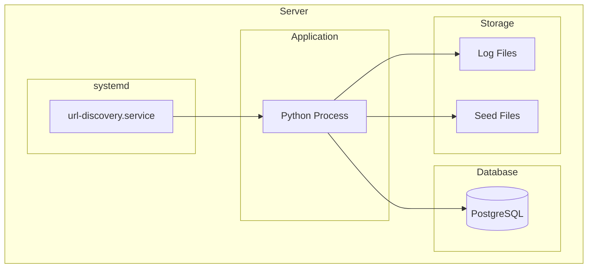

# Architecture Documentation

This document describes the complete system architecture of the Website Discovery Service, including component design, data flow, and deployment considerations.

## System Overview

The Website Discovery Service is a persistent, always-on URL discovery engine optimized for discovering Bangladeshi government (.gov.bd) domains. It runs as a systemd-managed service with PostgreSQL backing.

### Key Characteristics

- **Persistent**: All state stored in PostgreSQL with ACID guarantees
- **Resumable**: Can recover from interruptions via state persistence
- **Concurrent**: Asyncio-based with configurable worker threads
- **Modular**: Clean separation of concerns across packages
- **Production-ready**: systemd integration, structured logging, metrics

---

## High-Level Architecture



---

## Directory Structure

```
service/website_discovery/
├── .env.example              # Environment variable template
├── .gitignore                # Git ignore rules
├── config.yaml               # YAML configuration
├── pyproject.toml            # Project metadata & dependencies
├── requirements.txt          # Python dependencies
├── noxfile.py                # Task runner (linting, testing)
├── README.md                 # Main documentation
├── main.py                   # Service entry point
├── systemd/
│   └── url-discovery.service # systemd unit file
├── migrations/
│   └── 001_initial_schema.sql # Database schema
├── seeds/
│   └── input/                # Seed URL files
├── logs/                     # Log files (runtime)
├── src/
│   ├── __init__.py           # Package initialization
│   ├── config/
│   │   ├── __init__.py
│   │   └── settings.py       # Pydantic configuration
│   ├── database/
│   │   ├── __init__.py
│   │   ├── connection.py     # Connection pooling
│   │   ├── schema.py         # Schema initialization
│   │   └── models.py         # Pydantic ORM models
│   ├── crawler/
│   │   ├── __init__.py
│   │   ├── engine.py         # Discovery engine
│   │   ├── finder.py         # Domain extraction
│   │   └── queue.py          # Queue management
│   ├── services/
│   │   ├── __init__.py
│   │   ├── liveness.py       # Liveness checking
│   │   ├── health.py         # Health checks
│   │   └── metrics.py        # Metrics collection
│   └── tools/
│       ├── __init__.py
│       ├── ingest_seed_urls.py # Seed URL ingestion
│       └── status_report.py    # Status reporting
└── tests/
    ├── __init__.py
    ├── conftest.py           # Pytest fixtures
    ├── unit/
    │   ├── __init__.py
    │   ├── test_config.py
    │   ├── test_database.py
    │   └── test_crawler.py
    └── integration/
        └── test_end_to_end.py
└── docs/
    ├── README.md             # Documentation index
    ├── db_diagram.md         # Database schema
    ├── optimization.md       # Performance guide
    └── architecture.md       # This file
```

---

## Component Design

### 1. Configuration Layer (`src/config/`)

**Purpose**: Centralized configuration management

**Components**:

```
src/config/settings.py
├── AppConfig            # Top-level settings
├── DatabaseSettings     # PostgreSQL configuration
├── CrawlerSettings      # Discovery parameters
├── SchedulerSettings    # Queue scheduling
├── LivenessSettings     # Status check config
├── LoggingSettings      # Loguru setup
└── MetricsSettings      # Optional metrics
```

**Key Features**:

- Pydantic v2 models with validation
- Environment variable loading via `pydantic-settings`
- Default values with `.env` file support
- Type-safe access via `settings` singleton

**Example**:

```python
from src.config.settings import settings

# Access configuration
max_requests = settings.crawler.max_concurrent_requests
db_host = settings.database.host
```

---

### 2. Database Layer (`src/database/`)

**Purpose**: PostgreSQL interaction with connection pooling

**Components**:

```
src/database/
├── connection.py
│   └── ConnectionPoolManager  # Singleton pool
│   ├── get_pool()             # Get pool instance
│   ├── close_pool()           # Shutdown pool
│   └── acquire_connection()   # Context manager
│
├── schema.py
│   ├── initialize_schema()    # Create tables/indexes
│   ├── run_migration()        # Run migrations
│   └── verify_schema()        # Validate setup
│
└── models.py
    ├── Domain                 # Domain model
    ├── SeedUrl                # Seed URL model
    ├── UrlQueue               # Queue model
    ├── DiscoveryLog           # Log model
    └── DiscoveryStats         # Stats model
```

**Key Features**:

- Asyncpg connection pooling
- Pydantic ORM models for type safety
- Schema initialization via SQL
- Automatic connection recycling

**Example**:

```python
from src.database.connection import get_pool
from src.database.models import Domain

pool = await get_pool()
async with pool.acquire() as conn:
    domains = await conn.fetch("SELECT * FROM domains LIMIT 10")
```

---

### 3. Discovery Engine (`src/crawler/`)

**Purpose**: Main discovery orchestration

**Components**:

```
src/crawler/
├── engine.py
│   └── DiscoveryEngine
│       ├── run()              # Main loop
│       ├── _process_queue()   # Process queue items
│       ├── _extract_domains() # Extract from URLs
│       └── _save_state()      # Persist progress
│
├── finder.py
│   └── DomainFinder
│       ├── find_domains()     # Parse HTML for domains
│       ├── normalize_domain() # URL normalization
│       └── is_gov_bd()        # Filter .gov.bd
│
└── queue.py
    └── PriorityQueue
        ├── add()              # Add URL with priority
        ├── get_next()         # Get next URL
        └── cleanup()          # Remove stale items
```

**Key Features**:

- Asyncio concurrent processing
- Semaphore-based rate limiting
- State persistence for resume capability
- Graceful shutdown handling

**Example**:

```python
from src.crawler.engine import DiscoveryEngine

engine = DiscoveryEngine()
await engine.run()
```

---

### 4. Services (`src/services/`)

**Purpose**: Background operations

**Components**:

```
src/services/
├── liveness.py
│   └── LivenessService
│       ├── check_domain()     # HTTP status check
│       ├── check_batch()      # Parallel checks
│       └── schedule_recheck() # Queue retry
│
├── health.py
│   └── HealthService
│       ├── check()            # Health endpoint
│       ├── check_db()         # Database connection
│       └── check_disk()       # Disk space check
│
└── metrics.py
    └── MetricsCollector
        ├── collect()          # Gather metrics
        ├── export()           # Export format
        └── endpoint()         # HTTP endpoint
```

**Key Features**:

- Parallel liveness checking
- Health endpoint for monitoring
- Prometheus-compatible metrics

---

### 5. Tools (`src/tools/`)

**Purpose**: CLI utilities

**Components**:

```
src/tools/
├── ingest_seed_urls.py
│   └── ingest_seed_urls()   # Add seeds from file
│   └── main()                # CLI entry point
│
└── status_report.py
    └── generate_report()    # Statistics
    └── main()                # CLI entry point
```

**Example**:

```bash
# Add seeds from file
python -m src.tools.ingest_seed_urls seeds/input.txt manual

# Generate status report
python -m src.tools.status_report
```

---

### 6. Entry Point (`main.py`)

**Purpose**: Service orchestration

```python
async def main():
    """Service entry point."""
    # Initialize
    await initialize_database()
    await initialize_logging()

    # Create engine
    engine = DiscoveryEngine()

    # Set up signal handling
    loop = asyncio.get_event_loop()
    main_task = loop.create_task(engine.run())

    # Handle shutdown
    try:
        await main_task
    except KeyboardInterrupt:
        logger.info("Shutdown requested")
        main_task.cancel()
        await engine.save_state()
```

---

## Data Flow

### Discovery Process



### Seed Ingestion Flow



---

## State Management

### In-Memory State

```python
class DiscoveryEngine:
    def __init__(self):
        self.visited_urls: set[str] = set()      # URLs already processed
        self.found_domains: set[str] = set()     # Discovered domains
        self.queue: asyncio.Queue = asyncio.Queue()  # Pending URLs
        self.semaphore: asyncio.Semaphore = ...  # Rate limiting
```

### Persistent State

```python
class StateSerializer:
    def save(self, engine: DiscoveryEngine) -> None:
        """Save state to database."""
        # Save queue items
        queue_items = list(engine.queue)
        await self._save_queue(queue_items)

        # Save progress markers
        await self._save_progress({
            'last_processed': datetime.utcnow(),
            'total_discovered': len(engine.found_domains),
            'queue_size': engine.queue.qsize()
        })

    def load(self) -> dict[str, Any]:
        """Load state from database."""
        return await self._load_progress()
```

---

## Concurrency Model

### Asyncio-Based Parallelism

```python
# Semaphore limits concurrent requests
semaphore = asyncio.Semaphore(max_concurrent_requests)

async def worker(session, worker_id):
    while True:
        async with semaphore:  # Rate limiting
            url = await queue.get()
            response = await session.get(url)
            # Process response
            queue.task_done()
```

### Worker Pool

```python
# Create worker tasks
workers = []
for i in range(num_workers):
    task = asyncio.create_task(worker(session, i))
    workers.append(task)

# Wait for completion
await queue.join()

# Cancel workers
for w in workers:
    w.cancel()
```

---

## Error Handling

### Retry Strategy

```python
class RetryHandler:
    def __init__(self, max_retries: int = 3):
        self.max_retries = max_retries

    async def fetch_with_retry(self, url: str) -> Response | None:
        for attempt in range(self.max_retries):
            try:
                return await self._fetch(url)
            except TimeoutError:
                if attempt == self.max_retries - 1:
                    raise
                await asyncio.sleep(2 ** attempt)  # Exponential backoff
```

### Graceful Degradation

```python
async def process_url(self, url: str) -> Result:
    try:
        return await self._process(url)
    except Exception as e:
        # Log error, don't crash
        logger.error(f"Failed to process {url}: {e}")

        # Add back to queue with higher attempt count
        await self._retry_url(url, attempts + 1)

        return Result(success=False, error=str(e))
```

---

## Deployment Architecture

### Production Deployment



### systemd Service

```ini
[Service]
Type=simple
User=url-discovery
Restart=always
RestartSec=10
LimitNOFILE=65536
```

### Resource Requirements

| Component | Minimum | Recommended |
|-----------|---------|-------------|
| CPU | 2 cores | 4+ cores |
| RAM | 2 GB | 4+ GB |
| Storage | 5 GB | 10+ GB |
| Network | 10 Mbps | 100+ Mbps |

---

## Scaling Considerations

### Horizontal Scaling

Currently single-node design. For horizontal scaling:

1. **Queue Locking**: Use database advisory locks
2. **Leader Election**: One active worker per queue
3. **State Sharding**: Partition database by domain hash

### Vertical Scaling

Increase concurrent workers:

```yaml
crawler:
  max_concurrent_requests: 200  # Increase from 50
```

Monitor:

- CPU usage
- Memory consumption
- Network bandwidth
- Database connection pool

---

## Security Considerations

### Environment Variables

Never commit secrets:

```bash
# Use .env file (not in git)
cp .env.example .env
# Edit with real credentials
```

### Database User Permissions

```sql
-- Limited permissions for application user
GRANT SELECT, INSERT, UPDATE, DELETE ON ALL TABLES TO url_discovery;
GRANT USAGE, SELECT ON ALL SEQUENCES TO url_discovery;
-- NO DROP TABLE, NO CREATE TABLE
```

### SSL/TLS

```python
# Enable SSL for production
connector = aiohttp.TCPConnector(ssl=SSLContext())
```

---

## Monitoring & Observability

### Log Levels

| Level | When to Use |
|-------|-------------|
| DEBUG | Detailed tracing (development) |
| INFO | Normal operation (production) |
| WARNING | Recoverable errors |
| ERROR | Unrecoverable errors |
| CRITICAL | Service failure |

### Health Endpoint

```python
# Optional HTTP health check
@app.get("/health")
async def health_check():
    return {
        "status": "healthy",
        "domains_discovered": stats.total_domains,
        "queue_size": stats.queue_depth,
        "timestamp": datetime.utcnow()
    }
```

### Metrics

Collect and export:

- `domains_discovered_total` - Counter
- `liveness_checks_total` - Counter
- `queue_depth_gauge` - Gauge
- `response_time_seconds` - Histogram

---

## Future Enhancements

| Feature | Priority | Description |
|---------|----------|-------------|
| Redis Cache | Medium | Fast in-memory cache for domains |
| Web Dashboard | Low | UI for monitoring |
| API Endpoint | Medium | REST API for operations |
| Plugin System | Low | Custom discovery strategies |
| Distributed Queue | High | Kafka/RabbitMQ for scale |

---

## References

- [Database Schema](db_diagram.md)
- [Optimization Guide](optimization.md)
- [Main Documentation](../README.md)
