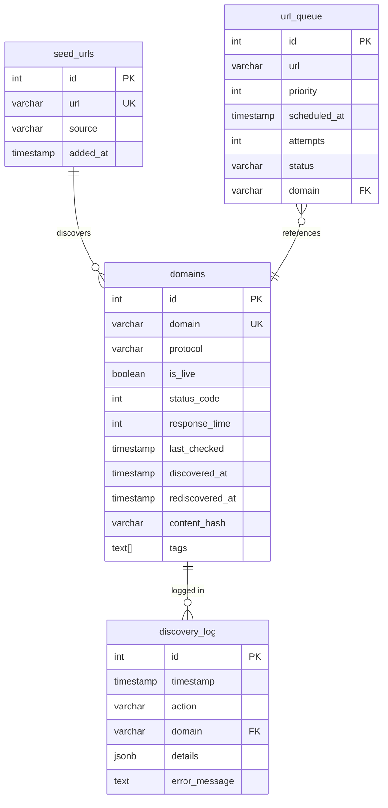
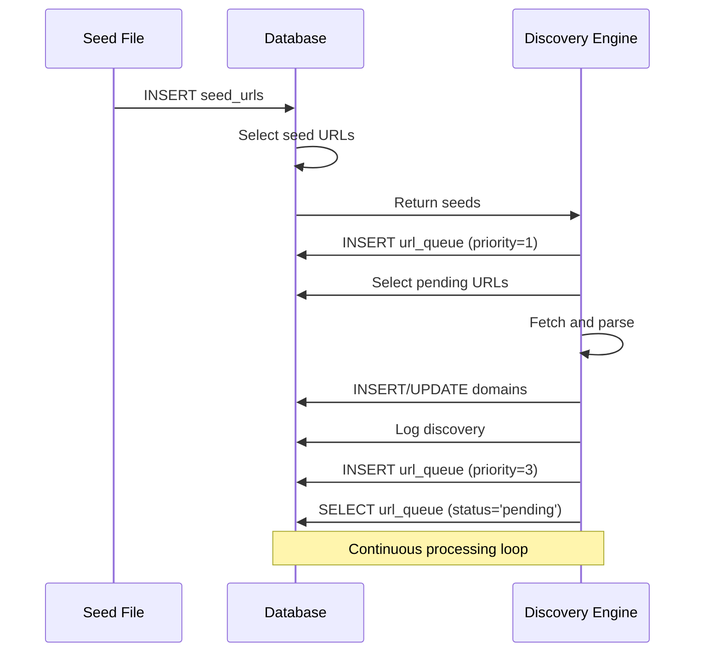

# Database Schema Documentation

This document provides a comprehensive explanation of the database schema for the Website Discovery Service.

## Entity Relationship Diagram



## Table Details

### `domains` Table

Stores discovered .gov.bd domains with their liveness status and metadata.

| Column | Type | Constraints | Description |
|--------|------|-------------|-------------|
| `id` | SERIAL | PRIMARY KEY | Auto-incrementing row ID |
| `domain` | VARCHAR(255) | UNIQUE, NOT NULL | Domain name (e.g., `example.gov.bd`) |
| `protocol` | VARCHAR(10) | DEFAULT 'https' | HTTP protocol (http/https) |
| `is_live` | BOOLEAN | DEFAULT TRUE | Current liveness status |
| `status_code` | INTEGER | NULL | Last HTTP status code (200, 404, etc.) |
| `response_time` | INTEGER | NULL | Response time in milliseconds |
| `last_checked` | TIMESTAMP | DEFAULT CURRENT_TIMESTAMP | Last liveness check time |
| `discovered_at` | TIMESTAMP | DEFAULT CURRENT_TIMESTAMP | When domain was first discovered |
| `rediscovered_at` | TIMESTAMP | NULL | When domain rediscovered after being dead |
| `content_hash` | VARCHAR(64) | NULL | Hash for content change detection |
| `tags` | TEXT[] | NULL | Array of tags for categorization |

#### Indexes

```sql
-- Domain lookups (unique)
CREATE UNIQUE INDEX idx_domains_domain ON domains(domain);

-- Query for live domains only
CREATE INDEX idx_domains_is_live ON domains(is_live);

-- Recently checked domains (for scheduling)
CREATE INDEX idx_domains_last_checked ON domains(last_checked);

-- Hash-based content comparison
CREATE INDEX idx_domains_content_hash ON domains(content_hash)
    WHERE content_hash IS NOT NULL;

-- Dead domains for recheck (partial index)
CREATE INDEX idx_domains_dead ON domains(domain)
    WHERE is_live = FALSE;
```

#### Triggers

```sql
-- Automatically update rediscovered_at when domain becomes live
CREATE TRIGGER trigger_update_rediscovered_at
    BEFORE UPDATE ON domains
    FOR EACH ROW
    EXECUTE FUNCTION update_rediscovered_at();

-- Log all new domain discoveries
CREATE TRIGGER trigger_log_discovery
    AFTER INSERT ON domains
    FOR EACH ROW
    EXECUTE FUNCTION log_discovery();
```

---

### `seed_urls` Table

Stores the initial seed URLs used to start the discovery process.

| Column | Type | Constraints | Description |
|--------|------|-------------|-------------|
| `id` | SERIAL | PRIMARY KEY | Auto-incrementing row ID |
| `url` | VARCHAR(500) | UNIQUE, NOT NULL | Full URL (e.g., `https://bangladesh.gov.bd`) |
| `source` | VARCHAR(50) | DEFAULT 'manual' | Source type (manual/batch/api/import) |
| `added_at` | TIMESTAMP | DEFAULT CURRENT_TIMESTAMP | When seed was added |

#### Indexes

```sql
CREATE UNIQUE INDEX idx_seed_urls_url ON seed_urls(url);
```

#### Trigger

Seeds automatically discover domains when processed.

---

### `url_queue` Table

Manages URLs pending discovery processing with priority-based scheduling.

| Column | Type | Constraints | Description |
|--------|------|-------------|-------------|
| `id` | SERIAL | PRIMARY KEY | Auto-incrementing row ID |
| `url` | VARCHAR(500) | NOT NULL | URL to process |
| `priority` | INTEGER | CHECK 1-5 | Queue priority (1=critical, 5=low) |
| `scheduled_at` | TIMESTAMP | DEFAULT CURRENT_TIMESTAMP | When URL should be processed |
| `attempts` | INTEGER | DEFAULT 0 | Number of processing attempts |
| `status` | VARCHAR(20) | CHECK pending/processing/completed/failed | Current queue status |
| `domain` | VARCHAR(255) | NULL, FK → domains | Associated domain if known |

#### Indexes

```sql
-- Queue processing (pending URLs by priority and time)
CREATE INDEX idx_url_queue_status_priority ON url_queue(status, priority, scheduled_at)
    WHERE status = 'pending';

-- Queue cleanup (by status)
CREATE INDEX idx_url_queue_status ON url_queue(status);
```

#### Priority Levels

| Priority | Use Case | Example |
|----------|----------|---------|
| 1 | Critical | Seed URLs |
| 2 | High | Recently rediscovered domains |
| 3 | Medium | Regular discovery URLs |
| 4 | Low | Liveness check URLs |

---

### `discovery_log` Table

Audit trail of all discovery actions and events.

| Column | Type | Constraints | Description |
|--------|------|-------------|-------------|
| `id` | SERIAL | PRIMARY KEY | Auto-incrementing row ID |
| `timestamp` | TIMESTAMP | DEFAULT CURRENT_TIMESTAMP | When action occurred |
| `action` | VARCHAR(50) | NOT NULL | Action type (discovered/checked/failed/rediscovered) |
| `domain` | VARCHAR(255) | NULL, FK → domains | Affected domain |
| `details` | JSONB | NULL | Additional structured data |
| `error_message` | TEXT | NULL | Error details if action failed |

#### Indexes

```sql
-- By domain (historical queries)
CREATE INDEX idx_discovery_log_domain ON discovery_log(domain);

-- By timestamp (recent activity)
CREATE INDEX idx_discovery_log_timestamp ON discovery_log(timestamp);

-- Status reporting
CREATE INDEX idx_discovery_log_status ON discovery_log(timestamp DESC)
    WHERE domain IS NOT NULL;
```

#### Action Types

| Action | Description | Details Example |
|--------|-------------|-----------------|
| `discovered` | New domain found | `{"protocol": "https", "source": "link"}` |
| `checked` | Liveness check | `{"status_code": 200, "response_time": 150}` |
| `failed` | Processing failed | `{"error": "Connection timeout"}` |
| `rediscovered` | Domain back from dead | `{"previous_status": "dead", "days_unreachable": 14}` |
| `retrying` | Retry attempted | `{"attempt": 2, "max_retries": 3}` |

---

## Views

### `v_live_domains`

Currently live domains with latest check information.

```sql
SELECT d.id, d.domain, d.protocol, d.status_code, d.response_time, d.last_checked, d.discovered_at
FROM domains d
WHERE d.is_live = TRUE
ORDER BY d.last_checked DESC;
```

### `v_dead_domains`

Dead domains ordered by last check (oldest first for recheck scheduling).

```sql
SELECT d.id, d.domain, d.status_code, d.last_checked,
       EXTRACT(EPOCH FROM (CURRENT_TIMESTAMP - d.last_checked)) as seconds_since_check
FROM domains d
WHERE d.is_live = FALSE
ORDER BY d.last_checked ASC;
```

### `v_discovery_stats`

Aggregated discovery statistics.

```sql
SELECT
    COUNT(*) as total_domains,
    SUM(CASE WHEN is_live THEN 1 ELSE 0 END) as live_domains,
    SUM(CASE WHEN NOT is_live THEN 1 ELSE 0 END) as dead_domains,
    MAX(discovered_at) as newest_discovery,
    MIN(discovered_at) as oldest_discovery,
    COUNT(DISTINCT CASE WHEN rediscovered_at IS NOT NULL THEN domain END) as rediscovered_count
FROM domains;
```

### `v_queue_summary`

Queue status summary by priority.

```sql
SELECT status, priority, COUNT(*) as count,
       MAX(scheduled_at) as latest_scheduled,
       MIN(scheduled_at) as oldest_scheduled
FROM url_queue
GROUP BY status, priority
ORDER BY status, priority;
```

---

## Functions

### `upsert_domain()`

Safely insert or update a domain.

```sql
SELECT upsert_domain(
    'example.gov.bd',
    'https',
    200,
    150,
    TRUE
);
```

### `get_next_queue_item()`

Get pending queue items for processing.

```sql
SELECT * FROM get_next_queue_item(10);
```

---

## Data Flow



---

## Maintenance

### Backup

```bash
# Full backup
pg_dump -U url_discovery url_discovery_db > backup.sql

# Backup specific tables
pg_dump -U url_discovery -t domains -t seed_urls url_discovery_db > important_tables.sql
```

### Restore

```bash
# Full restore
psql -U url_discovery -d url_discovery_db < backup.sql

# Restore from backup in production
psql -U url_discovery -d url_discovery_db -f backup.sql
```

### Index Maintenance

```sql
-- Rebuild indexes
REINDEX TABLE domains;

-- Analyze tables for query optimization
ANALYZE domains;
ANALYZE url_queue;
ANALYZE discovery_log;
```

---

## Migration History

| Version | Date | Description |
|---------|------|-------------|
| 1.0.0 | 2026-04-14 | Initial schema with 4 tables, 12 indexes, 6 views |
